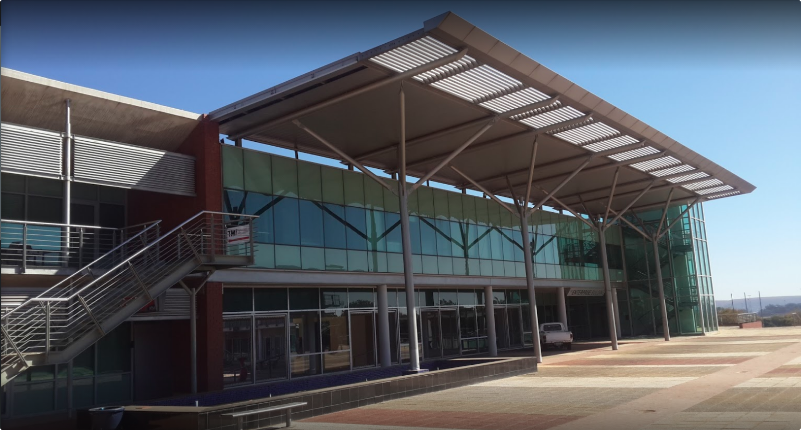

When our youth are empowered with the right skills to innovate and create solutions, they unlock the opportunities for new businesses that will drive our economies forward. This is why we support these young innovators, founders, next generation coders and digital creatives.

In 2012 mLab Southern Africa (Mobile Applications Laboratory NPC) launched as a mobile technology accelerator with the aim of supporting innovative new startups and to unlock the mobile apps economy. Since then we have grown into an open innovation lab which includes programmes that support skills development through our own and partner code academies, facilitated co-creation seasons with industry and public sector partners and we continue to build on our successes as a local tech start-up lab.

mLab Southern Africa is a registered Nonprofit organization and Level 1 B-BBEE service provider focusing on Skills and Enterprise Development as well as Lean Innovation Facilitation and Supplier Development Support. We have proudly partnered with founding partners The Ministry of Foreign Affairs of Finland, The Department of Science & Technology, The Innovation Hub, The CSIR, The V&A Waterfront and the World Bank.

#### **What is a Start-up Lab vs. traditional incubators or accelerators?**

A **laboratory** is a facility that provides controlled conditions in which scientific or technological research, experiments, and measurement may be performed. As a start-up Lab we provide a controlled environment and process to experiment forward from a concept or idea to a minimal validated product that can be further tested, iterated and scaled in market (published to app stores or piloted).

An Incubator is a place, especially with support staff and equipment, made available at low rent to new small businesses.

An Accelerator is a person or thing that causes something to happen or develop more quickly. In the start-up economy this is typically structured as a short but intensive and focused programme.