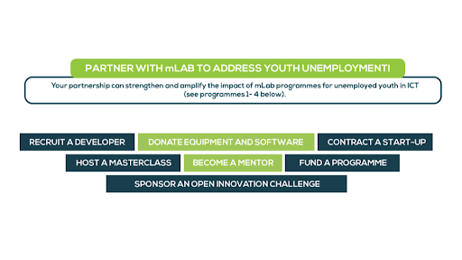
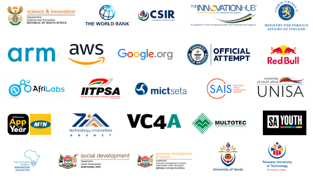

### Work with Us

**We want to impact 1 Million Young People in ICT - 1 job and 1 rand at a time, would you like to join us in this journey?**

With over 10 years’ experience of working with multinationals and public sector organisations to implement locally relevant programmes, mLab is a value adding partner. It serves as a powerful implementation instrument in the South African National System of Innovation. Given that mLab is registered as a non-profit organisation (NPO) with Public Benefit Organisation (PBO) status and is Level 1 B-BBEE certified - resulting in a number of financial and non-financial benefits for partners. 

mLab has a proven track record in delivering impact within all of its projects. It is a highly agile organisation that can successfully and cost-effectively deliver innovative programmes and projects. We pride ourselves in understanding the local context and adapting programmes to ensure that we build an inclusive digital ecosystem, whilst ensuring knowledge transfer and local capability development. We invite you to engage with us to explore a range of collaboration models that can help you achieve your objectives.

### Activity Partners

