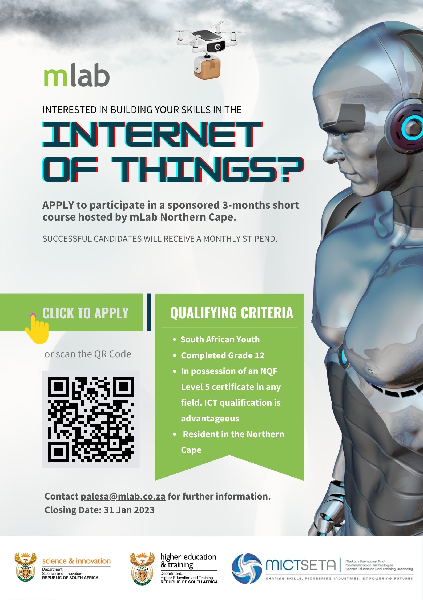

##### The opportunity

Are you based in the Northern Cape and looking for an opportunity in ICT?

This could be your life-changing lucky chance. We’re looking for youth to go through a 3-months course on the Internet of Things (IoT). The goal of this quick course is to provide an introduction to the Internet of Things and to prepare youth for opportunities that exist in the industry.

##### Why? 

Developing digital talent, innovative technology and successful entrepreneurs are the pillars on which Africa will build a prosperous and sustainable future.  

This is why mLab supports young innovators, founders, next generation coders and digital creatives to build Africa’s digital future. mLab believes that when our youth are empowered with the right skills to innovate and create solutions, they unlock opportunities for new ventures that will drive our economies forward.

##### How to apply

To apply for this opportunity, click on the ‘Application form’ link below, which will direct you to the form to fill in. 

**The deadline for applications is 31 January 2023.**

Application form: <https://bit.ly/3GPclS8>