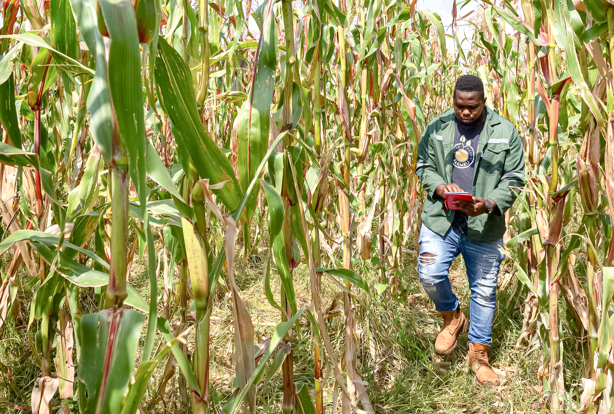
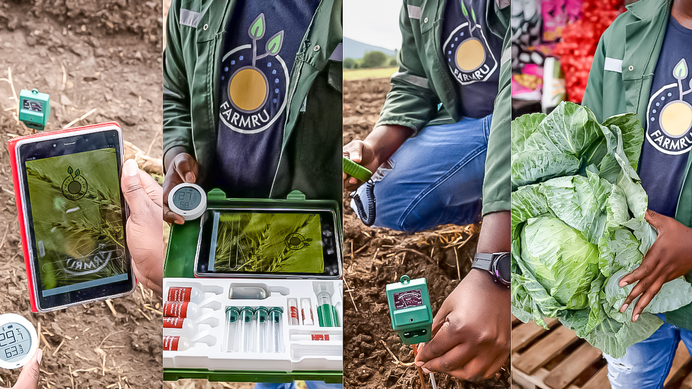

On 18 -19 April 2023, the Regional Innovation Support Programme (RISP) with support from the Department of Science and Innovation (DSI) held its 3rd Annual Regional Innovation Forum at the Council for Scientific and Industrial Research (CSIR), in Pretoria. 

Three of our AgriTourZA Start-Up programme beneficiaries participated in the Innovation Challenge by RISP, they competed against other RISP beneficiaries. Competitors pitched in front of a panel of judges and only three finalists were selected to walk away with R150 000, R100 000, and R25 000.

#### **Motivated by the village he comes from, he decides to start an empire**

Tsedzuluso Netshimbupfe the CEO and Founder of startup company Farmru is one of our AgriTourZA alumni who competed in the Innovation Challenge. Netshimbupfe's Farmru was incubated by mLab in 2021 and ever since he has been making strides.

He hails from the village of Tshimbupfe in Thohoyandou in Limpopo,  a dry area where food security is a major concern for villagers. Netshimbupfe's company Farmru developed a technology device that assists farmers by saving water and maintaining optimal soil quality for the production of healthy crops. It monitors the environment and executes tasks using a low-cost microcontroller device.

\
He said Farmru strives to help farmers to move from subsistence farming to commercial farming.

#### **Winning the RISP Innovation Challenge**

Pitching a business with limited time in front of judges can be extremely daunting but Netshimbupfe did it, out of more than eight competitors, he won second place in the prizes.

He walked away with R100 000 which comes in the form of market access,  technology development, patenting, and IP support. 

"Winning this prize feels amazing because to me it speaks to the whole journey of Farmru, we appreciate the support so much", he said. He said that he would like to extend sincere gratitude to Choene Nkoana, who manages the AgriTourZA project, calling her a 'Champion'.

#### **The dream is alive**

Speaking on the struggle that the Covid-19 pandemic induced on businesses, he said during and post the pandemic, things seemed gloomy for the business. But support like this makes the business dream alive, "The fire is still on and we are excited about the future", he said. 

With an understanding that there might be a budding entrepreneur from a village or a township who feels like giving up and perhaps might hit on this story. 

He said, "One thing I have realised is that successful people are consistent with their vision and sometimes you might have to pivot but keep knocking on doors and push what you believe in".