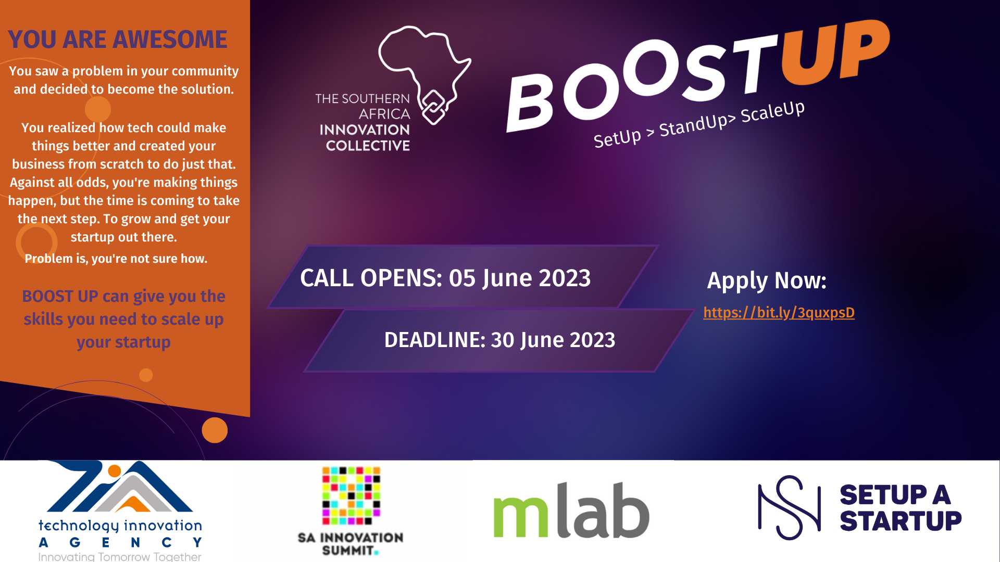

Boost Up is a three-part startup support programme organised by the Southern Africa Innovation Collective (SAIC) in Botswana, Namibia, South Africa, Tanzania and Zambia. The programme targets startups that use technology and innovation to solve a societal challenge and are looking for skills that could help them to pitch their business and become more investment-ready.

The Boost Up series comprises Set Up training events, Stand Up pitch competitions, and the Scale Up incubation programme.

**Set Up** 

Boost Up Set Up provides entrepreneurs with practical tools to package their business idea and develop a pitch to attract their target market. The Set Up training is organised separately in each of the BOOST UP countries: Botswana, Namibia, South Africa, Tanzania, and Zambia.

**Stand Up pitch competitions** 

At Boost Up Stand Up, committed startups who are eager to make an impact, have a scalable business model, and want to become more investable will compete in national pitching competitions in their countries. Connected Hubs representatives will select about 10 startups per country from the Set Up participantZAs that completed the training and invite them to pitch at Stand Up. At the pitching competitions, panels of expert judges will select the top startups to advance to interviews. After the interviews, one to two promising startups per country will be selected to take part in the Boost Up Scale Up incubator.

**Scale Up incubation programme** 

Boost Up Scale Up is an incubation programme for impact-driven startups eager to become more investable. Scale Up includes an online incubation programme (September – November) and an on-site Bootcamp in Nairobi in Kenya.

#### Apply for the BoostUp programme if: 

* Your startup is a registered business located in Botswana, Namibia, South Africa, Tanzania, or Zambia.
* Technology and innovation play a key role in your business model to address a societal challenge in Southern Africa.
* You have a scalable business model.
* You are developing or finalising a prototype, or have a prototype ready.
* You or your startup have not won a SAIS 2-associated national pitch competition and participated in the Boost Up Bootcamp in 2022 or 2019, Slush Global Impact Accelerator 2018, or been sponsored by SAIS 2 to participate in Slush 2017.

Applications for 2023 are currently, to apply click on the ‘application form’ below. Application deadline is 30 June 2023.

[APPLICATION FORM](https://bit.ly/3quxpsD)