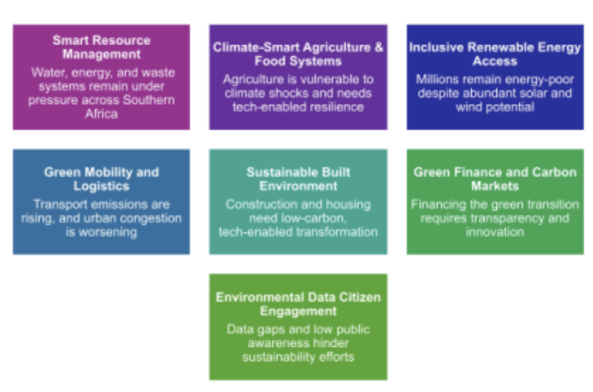
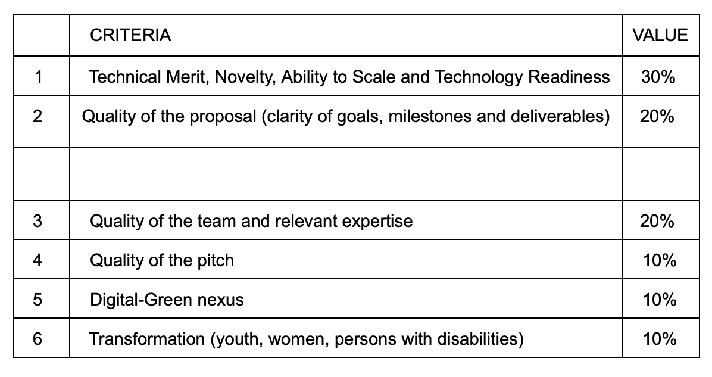

**CHALLENGER DIGITAL and GREEN ACCELERATOR PROGRAMME** 

### CONTEXT 

The climate crisis and sustainability of the planet is no longer a distant threat. It is a current reality affecting ecosystems, economies and everyday life across the globe. From heatwaves and erratic rainfall to rising sea-levels and loss of biodiversity, the planet is sounding alarms that cannot be ignored. In Southern Africa, these shifts are particularly stark: droughts are deepening, food systems are under threat, and vulnerable communities are bearing the brunt. 

This dire situation demands urgent action and development of innovative solutions to address these critical challenges. Consequently, the Challenger Digital and Green Accelerator Programme (Challenger D&G) aims to catalyse the development of digital, green, and circular innovations that address pressing environmental and socio-economic challenges in support of: 

● Climate adaptation and resilience 

● Food security and sustainable agriculture 

● Water conservation and renewable energy solutions 

● Urban mobility and waste management 

In response to the European Union’s Multi-Donor “Digital and Green Innovation Action” initiative, Challenger D&G will support up to 25 high-potential startups working at the intersection of technology, sustainability, and social impact. To qualify, startups must address at least one green transition objective (e.g. climate adaptation, circular economy, biodiversity protection) and be classified as sustainable, green or circular businesses (or enterprises), defined as follows: 

● Sustainable businesses focus on reducing the negative impact of their operations on the environment and people in society. 

● Green businesses provide commercial solutions to environmental challenges that are economically viable and often socially empowering. 

● Circular businesses focus on creating a closed-loop system where resources are reused and recycled to minimise waste and maximise resource efficiency while eliminating or minimising the use of toxic, non-biodegradable chemicals and relying on renewable energy. 

## Strategic Focus Areas 

Challenger D&G has prioritised innovative solutions in the following focus areas: 

\
\
**PROGRAMME OUTLINE** 

We are looking for bold entrepreneurs with early-stage startups registered in either South Africa, Namibia, or Botswana who are building digital, green, and/or circular solutions addressing the strategic focus areas. The programme is structured to help participants refine their business models, strengthen investment readiness, and access opportunities to grow their impact. Delivered by Civitta in collaboration with mLab, GrowthAfrica, Latitude59, and Startup Wise Guys, the programme is part of a broader effort to connect Africa’s innovators with investors, markets, and global opportunities. The Digital and Green Innovation Action is co-funded by the participating Team Europe partners (Germany, France, Belgium, the Netherlands, and Estonia) and the European Commission. 

Challenger D&G will support up to 25 startups through a virtual acceleration programme between November 2025 and May 2026. Successful applicants will be supported to attend a compulsory in-person 2-day bootcamp to be held in Pretoria/Johannesburg in December 2025. 

## Benefits of the programme: 

Challenger D&GI is an opportunity to build, connect, and grow your business with the support of leading entrepreneur networks and investors. By joining, you will: 

● Strengthen your business model and investment readiness 

● Gain access to local and international mentors 

● Connect with investors and corporate partners 

● Build your visibility through regional and global exposure 

● Join a growing network of African startups driving digital and green innovation. What will participating startups receive 

The cohort of up to 25 successful startups will receive: 

● Practical business acceleration 

o A structured learning and support journey covering business model refinement, market access, scaling strategies, and leadership. 

● Expert mentorship 

o One-on-one and group mentorship with experienced entrepreneurs, investors, and technical experts from across Africa and Europe. 

● Investor readiness and connections 

o Training to refine your fundraising strategy, build a winning pitch, and connect with investors seeking digital and green ventures. 

● Market and visibility opportunities 

o Access to networks, partnerships, and visibility through platforms such as Latitude59 

On a competitive basis: 

● Between 3-6 startups will be supported to attend a Latitude 59 event in Nairobi Kenya from 3 - 5 December 2025 

● 3 startups will be supported to attend a Latitude 59 event in Estonia in May 2026 ● The top 3 startups will receive a grant at the end of the programme from a total prize pool of 15,000 Euro 

### **KEY DATES** 

● Applications open on 21 October 2025 

● Deadline for applications: 14 November 2025 

● Programme launch and onboarding: 21 November 2025 

● Bootcamp: in person on 8 - 9 December 2025 in South Africa 

● Programme end: May 2026 

### **HOW TO APPLY** 

Please submit your proposal via the F6S portal. Applications must include: 

● An outline of your solution, competitive analysis, unique value proposition, team, and intended impact 

● An accompanying 2 minute pitch video motivating for your selection and outlining how your startup will benefit from the programme 

### **PROPOSALS** 

Challenger D&G invites startups from South Africa, Namibia, and Botswana to apply for a transformative journey of growth, networking and mentorship. The proposed solutions must not be older than 5 years and must fall within at least one of the priority focus areas. Preference will be given to those solutions that are at an advanced development stage (between Technology Readiness Levels 4 - 7) or close to market pilot/entry. Applicants must clearly articulate how the proposed solution will scale and achieve sustainability. 

**Proposal outline:** 

Proposals must be submitted via the F6S portal and cover the following: 

1. A problem statement and quantification of the problem. 

2. Description of the proposed solution, including a brief competitor analysis, highlighting what makes the proposed solution unique, how it will scale and its potential business model. 

3. Given the limited timeframe of this project, clearly articulate the complete route and timelines to market or sustainability for the proposed solution, and what component of that will be achieved within the scope of the programme period. Additionally, outline how you intend completing the project beyond this period. 

4. Measures of success, outcomes and impact that the solution can achieve. 5. Description of key team members (please include concise CVs) 

6. Project Risk Analysis and Mitigation. 

7. A pitch video no longer than 2 minutes motivating for your spot in the programme. Required Documents to accompany the proposal 

The following documents must accompany your application: 

1. CIPC registration document including shareholding structure (if applicable) 2. Company Profile 

3. Identification document (ID) for the primary contact person 

4. Tax Clearance Certificate 

Preference will be given to: 

Youth, female and/or black-owned enterprises 

### **Selection Criteria**

**Queries can be emailed to:** mamosetse@mlab.co.za 

**F6S portal:** https://www.f6s.com/digital-green-tech-innovation-ap/about 

### Annexure A - Examples of fundable solutions 

**Strategic Focus Areas** 

The D&GIAP has prioritised innovative solutions in the following focus areas: 

**1. Smart Resource Management** 

Water, energy, and waste systems are under pressure across Southern Africa. 

● Examples of innovative solutions: 

o IoT-enabled water monitoring and leak detection 

o AI-driven energy optimisation for households and SMEs 

o Digital platforms for waste tracking, recycling, and circular logistics 

**2. Climate-Smart Agriculture & Food Systems** 

Agriculture is vulnerable to climate shocks and needs tech-enabled resilience. 

● Examples of innovative solutions: 

o Precision farming using satellite data and sensors 

o Mobile platforms for agro-advisory, input access, and market linkage o Blockchain for traceability and carbon footprint tracking 

3. Inclusive Renewable Energy Access 

Millions remain energy-poor despite abundant solar and wind potential. 

● Examples of innovative solutions: 

o Pay-as-you-go solar and microgrid platforms 

o Digital tools for energy demand forecasting and load balancing

 o Community-based clean energy marketplaces 

**4. Green Mobility and Logistics** 

Transport emissions are rising, and urban congestion is worsening. 

● Examples of innovative solutions: 

o E-mobility solutions with digital fleet management 

o Route optimisation and carbon tracking for logistics 

o Shared mobility platforms with sustainability incentives 

5. Sustainable Built Environment 

Construction and housing need low-carbon, tech-enabled transformation. 

● Examples of innovative solutions: 

o Digital twins for green building design and retrofitting 

o Platforms for sustainable materials sourcing and reuse 

o Smart home systems for energy and water efficiency 

**6. Green Finance and Carbon Markets** 

Financing the green transition requires transparency and innovation.

 ● Examples of innovative solutions: 

o Digital platforms for climate risk assessment and ESG scoring o Tokenized carbon credits and blockchain-based verification o Fintech for green microloans and climate insurance 

**7. Environmental Data & Citizen Engagement** 

Data gaps and low public awareness hinder sustainability efforts.

 ● Examples of innovative solutions: 

o Crowdsourced environmental monitoring apps 

o Gamified platforms for behaviour change and eco-literacy 

o AI tools for policy modelling and impact forecasting