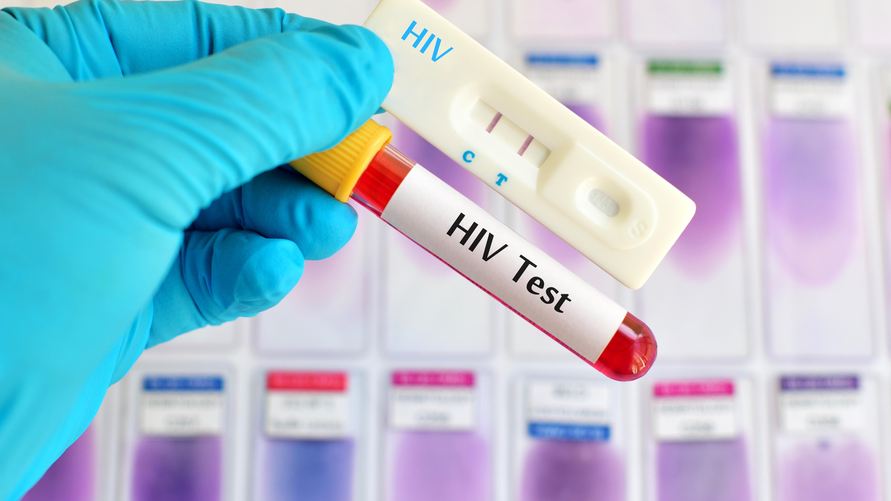

##### CONTEXT

PATH is a US-headquartered non-profit organization whose mission is to advance health equity through innovation and partnerships. In relation to the project titled “Optimising data systems and digital health in South Africa,” Digital Square at PATH, is collaborating with Mobile Applications Laboratory (mLab), a technology innovation and skills accelerator, to manage two digital health, HIV/Tuberculosis-related innovation grants.

##### TB and HIV context in South Africa

The top 2 ailments in South Africa in terms of burden of disease are:

* HIV/AIDS: South Africa has the highest prevalence of HIV/AIDS in the world, and the disease remains a major public health challenge, and 
* Tuberculosis (TB): TB is the leading cause of death in South Africa, and the country has one of the highest TB incidence rates in the world 

Less than half the estimated 328,000 people with TB in 2021 were successfully treated.  Almost 120,000 people with TB had not been diagnosed and / or initiated on treatment and over 70,000 of those on treatment did not complete the full 6-month course of treatment.  The World Health Organisation estimates that 55,000 people died from TB in South Africa in 2021 and it remains a leading cause of death in South Africa.  The high prevalence of HIV, and socio-economic risk factors such as poor nutrition, over-crowding, and poor health-seeking behaviour all contribute.   

TB testing and treatment are available at no cost at public Primary Health Care (PHC) facilities.  Yet, less than 50% of People With TB (PWTB) are diagnosed and durably cured.  The South African health system has also made progress over the past few years to recover from Covid-19 losses through the implementation of the National TB Recovery Plan.  TB testing increased by approximately 25% in 2022, reversing the declining testing trends seen in the pre-pandemic era, contributing to reduction in the diagnostic gap. 

However, challenges remain with linkage and retention in care.  Approximately one in five patients diagnosed with TB are not initiated on treatment.  This is partly due to treatment initiation requiring a second visit by a patient tested for TB, because it takes between 1 and 2 days for labs to process a TB test and share lab results. Patients that provide a mobile phone number receive their lab results from the National Health Laboratory Service (NHLS) via SMS. Hospital diagnosed patients disproportionately contribute to the linkage gap. PHC facilities are expected to follow up with patients that tested positive but have not been initiated on treatment, as well as patients that initiated treatment but have not returned for their monthly medication pick-up. 

South Africa has one of the highest HIV prevalence rates globally, with approximately 20% of adults living with HIV in the country.  Despite progress in reducing new HIV infections, the number of new infections remains substantial.  TB remains a leading case of death among people living with HIV.  

South Africa has made significant strides in increasing access to antiretroviral treatment (ART). The country has one of the largest ART programmes in the world, with more than 5.5m patients on ART.  Patients are able to pick up their HIV treatment at public primary health care clinics or other pick-up points available through the Central Chronic Medicines Dispensing and Distribution (CCMDD) programme.  The programme provides more convenient options for patients to pick up their medication thus improving access and reducing workload on staff at primary healthcare facilities.  However, a high proportion of patients cycle in and out of care at multiple points, particularly in the first 6 months. 

In a demonstration of community-based strategies for HIV testing, ART initiation, and monitoring, People Living with HIV (PLHIV) were successfully reached and achieved 73% viral suppression.  The community-based intervention also eliminated gender disparities in viral suppression.  Community-based services engage participants who report high satisfaction with community-based services, value the convenience, and report lower concerns for stigma associated with community-based services compared with clinic-based services. 

A sizable proportion of TB, HIV and TB/HIV co-infected patients move between levels of care, often across sub-districts, districts and provinces.  The siloed data systems, sub-optimal use of unique identifiers, and data systems that are predominantly offline make it difficult to get accurate statuses for TB and HIV patients.  Improving the quality of HIV and TB programmes using health information systems involves effectively collecting, analysing, and utilising data to enhance decision-making, monitor progress, and optimize patient care.

Achievement of the Joint United Nations Programme on HIV/AIDS (UNAIDS) 95-95-95 targets and other health goals rely on optimal functioning of the health system, which can be strengthened by digital health interventions.  The success of digital health interventions, in turn, relies on an effective digital health ecosystem, including governance mechanisms to coordinate across stakeholders and establish strategic priorities, a trained workforce to support and use digital health, and integrated systems that enable data collection, sharing, access, and use to enhance care coordination, service delivery, and efficiency.

South Africa has numerous policies, strategies, and guidelines governing the public health system, health programmes (including HIV), the workforce, and digital health systems.  The National Digital Health Strategy provides the overall strategic direction to strengthen digital health, while the National Health Normative Standards Framework for Interoperability in eHealth 2014 provides the baseline for creating interoperable applications and systems.  However, progress with implementation and policy compliance is hampered by a lack of sufficient financial and human resources, inadequate information and communications technology infrastructure, differences in implementations between provinces, and a rapidly deteriorating electricity network among other challenges.  

There are also still many needs to be met to establish interoperability between siloed registries, duplicate and fragmented systems, applications, and tools. TIER.Net is utilised nationally for managing patient level data of TB and HIV patients in Primary Health Care facilities. TIER.Net dispatch files from PHC facilities are transferred to higher levels of the health system once a quarter (some facilities transfer data monthly) to overcome connectivity challenges. Aggregated data from TIER.Net data is exported to DHIS for decision-making at District, Provincial and National levels. 

DHIS is also used for collecting and reporting aggregated data collected in the manual patient registers of most other health programmes (including Maternal, Neonatal, Child Health and nutrition, Family Planning, Expanded Programme on Immunisation, etc). The Health Patient Registration System (HPRS) is used in almost all PHC facilities for recording all PHC visits (irrespective of purpose of visit). It issues a Health Patient Registration Number (HPRN) to all patients, cross-referencing this number to patients’ other identifiers (SA ID, drivers licence, passport, refugee number, etc), for uniform consumption in health records and other IT systems. However, challenges remain with implementation; patients can have multiple identifiers because of suboptimal IT support, internet connectivity, and loadshedding. Laboratory results from the National Health Laboratory Services are also available as PDFs through an online access-controlled system (TrakCare) for registered clinicians. 

Despite these challenges, tremendous potential remains to grow and harness in-country technological and digital health expertise to innovatively solve health obstacles in a sustainable and impactful manner. 

The National Digital Health Strategy for South Africa, 2019 – 2024, reports that digital health technologies provide opportunities to strengthen health systems, transforming the way health services are provided and the way in which people engage with those services.  The strategy is intended to strengthen digital health governance structures, create robust integrated platforms for development of information systems and establish the requisite broadband network infrastructure in conjunction with other government departments.

Some of the key areas of growth in the South African digital health market include telemedicine, mobile health (mHealth), and electronic health records (EHRs).  These solutions are being developed to improve access to healthcare, increase patient engagement, and enhance the quality of care delivered by healthcare providers.

##### **PROBLEM STATEMENTS**

Digital health and data-driven solutions that address the key problems listed below are being sought: 

1. High Loss to Follow-up Rate for HIV and TB Patients: There is a significant initial linkage and loss to follow-up rate among patients diagnosed with HIV and TB.  This issue is exacerbated by patients not receiving their test results promptly, which hampers the initiation of treatment.  Additionally, a substantial portion of loss to follow-up cases is attributed to hospital-diagnosed patients who are referred to PHCs for receiving their treatment and are then lost to follow-up.  Innovative solutions are needed to link patients to treatment and ensure their retention in care. 
2. Undiagnosed TB Cases and Transmission Risk: Many TB patients are unaware of their condition, leading to unintentional transmission.  Key challenges include patients avoiding testing and not receiving their test results promptly, delaying treatment initiation.  Addressing this issue requires innovative approaches to increase TB awareness, testing, and early diagnosis, and improved patient agency. 
3. Loss to Follow-up Among PLHIV in the First Six Months of Treatment: Patients living with HIV (PLHIV) often experience a high rate of loss to follow-up during the first six months of treatment.  The lack of data integration between different healthcare systems and facilities makes patient monitoring challenging.  Innovative solutions are needed to enhance patient tracking and ensure continuity of care for PLHIV.
4. Supporting TB and HIV integration – More than 50% PWTB are also PLHIV. A need exists to improve TB testing among HIV patients, and ensure that patients with these comorbidities receive patient centric care, and are able to receive integrated healthcare services (not needing two separate visits to the health facility, one for each condition), to reduce opportunity costs for both the patients and the health system. 
5. Patient Mobility and Fragmented Healthcare Records: Patients are frequently referred across various healthcare facilities, including community-based services, primary healthcare facilities, and hospitals.  Moreover, patients may move across administrative boundaries, making it challenging to track and provide consistent care.  Current decentralized and siloed IT systems contribute to this issue.  Proposals that speak to the proposed NHI framework are sought to improve patient identification and facilitate a patient-centric approach to healthcare, ensuring continuity of care for PLHIV and patients with TB.
6. Digital Tools for Treatment Adherence and Health System Navigation: There is a need for digital tools and resources to support patients in accessing the health system, adhering to their treatment regimens and navigating the healthcare system effectively.  These tools should empower patients to take control of their health while facilitating their interaction with the healthcare system.

##### **CALL FOR PROPOSALS**

mLab is seeking proposals from emerging enterprises in the start-up phase, or enterprises whose proposed solutions are not older than 5 years, and that clearly address any of the problem statements outlined.  Preference will be given to those solutions that are at an advanced development stage or close to market pilot/entry.  However, novel early-stage solutions that have been clearly substantiated may also be considered.  University teams are also encouraged to apply.  Applicants must clearly articulate how the proposed solution will scale and achieve sustainability.

Two grant awards are available. The grant is geared towards enterprises that intend meeting one or more of the following milestones: 

* Demonstrate the feasibility of their solution in a real-world context
* Conduct market validation or pilot their solution 
* Building a conceptual model, collect and develop a data-driven solution
* Conduct market research or feasibility studies to demonstrate the socio-economic potential of their solutions.

**Proposal outline:**

The proposal must not be longer than 15 pages and must include the following sections:

1. The problem statement being addressed and why it was selected. Please give an indication of the health official or health facility that you are engaging with to support implementation of your solution, or indicate if this has not yet been initiated.  Whose problem are you addressing (patient, health provider or health system)? How do you plan to address the problem? 
2. Description of the use case, proposed solution, including a brief competitor analysis, highlighting what makes the proposed solution unique, how it will scale and its potential business model.
3. Given the limited timeframe of this project, clearly articulate the complete route and timelines to market what component of that will be achieved with the grant period, and how you intend completing the project beyond the end of the grant period.
4. 5-month project plan with specific work packages with key milestones, deliverables and timelines.
5. Detailed budget (what will the grant funding be used for).
6. Measures of success, outcomes and impact that could be achieved.  
7. Description of key team members (please include concise CVs as an appendix).
8. Three references with contact details of clients or other partners who can speak to your experience in similar initiatives.
9. Project Risk Analysis and Mitigation. 

##### Required Documents to accompany the proposal

*The following documents must accompany your application:*

1. CIPC registration document including shareholding structure (if applicable)
2. Company Profile 
3. Identification document (ID) for the primary contact person
4. Tax Clearance Certificate
5. BBBEE certificate

*Preference will be given to:*

1. Enterprises with a BBBEE level between 1 and 4
2. Youth, female and/or black-owned enterprises

**Duration**

The project must be completed, and a final report submitted, by 25 June 2024.

**Selection Criteria**

* Technical merit, novelty , feasibility, and potential for scale? 45%
* Quality of the proposal (clarity of goals, milestones and deliverables) 25%
* Quality of the team and relevant expertise 20%
* Transformation (youth, women, BBBEE rating) 10%

**Value of the grant**

Two awards will be made to a maximum value of R1,2 million per grantee.  This will be payable in tranches and against agreed milestones.

To Apply, click on this **[APPLICATION FORM](https://docs.google.com/forms/d/1M3IqTlL4_zfMvaHbQpshGpypD5dREZLQQKCpmIapPCU/edit).**

Queries can be emailed to: nicki@mlab.co.za

Closing date: 14 December 2023 at 17:00