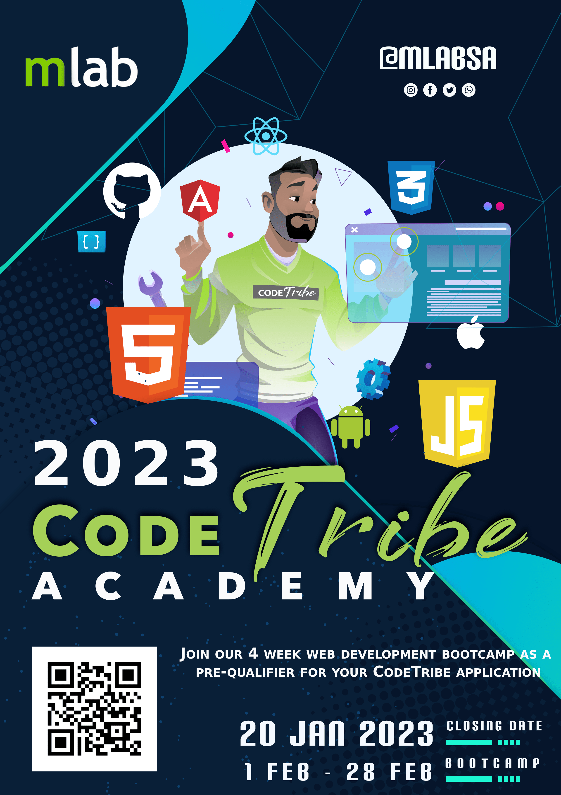

## **Introduction** 

mLab runs the CodeTribe Academy which aims to drive inclusive digital innovation in South Africa.

The coding programme provides training and work experience to talented youth in the townships to develop – Android, iOS, and Web solutions. Participants are also up-skilled in cloud technologies, scrum agile project management, and other soft skills to drive employment and self-employment.

With over 500 developers trained and 48% being females, the programme assists graduates to pursue employment and self-employment careers in ICT.

## **The CodeTribe Academy Bootcamp**

The Bootcamp runs for 4 weeks, in the 4 weeks, applicants are upskilled with the necessary basic web development skills. Applicants must go through the Bootcamp to qualify to be in Codetribe Academy.

## **Programme Duration** 

CodeTribe is a 6-month Software development programme. 

## **Application and recruitment process**

After successful completion of the CodeTribe Bootcamp, the candidates will receive an automated entry into CodeTribe and thus be invited for the final interview.

The interview process will evolve around your academic record, theoretical knowledge, previous projects, and lastly skills attained through the Bootcamp.

Upon successful completion of the Bootcamp, candidates will receive a certification of attendance highlighting all the skills attained in the Bootcamp.

## **How to Apply** 

To apply click on the application form link below.

<https://bit.ly/CodeTribe23>