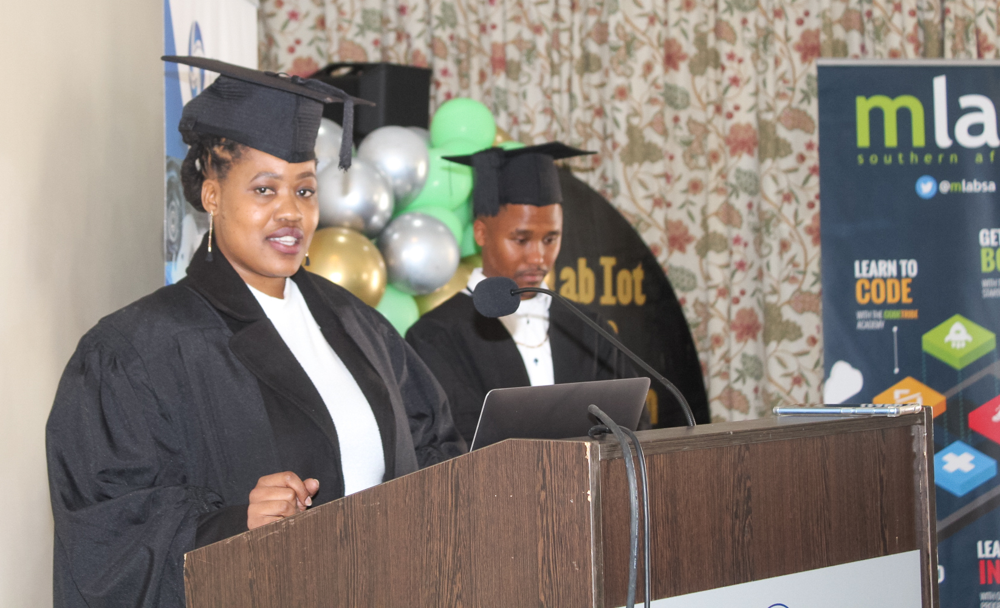

It is the eagerness to succeed, fresh ideas, and enthusiasm that mLab loves about hiring young people. We saw great potential in Refilwe and most importantly her capability to impart tech skills to others. Just a year after graduating from our coding academy, she took part in our short Internet of Things (IoT) training this year, and now she joins our staff. 

She has worked for the Department of Transport, Safety and Liaison as a Technician, she was a Student Lecturer at Rhodes Technical College. Additionally, she’s worked as a Financial Advisor for Metropolitan and Sanlam Sky.

#### \    Joining the mLab team

“I'm extremely excited for the chance to work with talented and motivated people to add to the organisation's central goal, which is to empower South African youth with digital technology skills and entrepreneurial expertise”, she said. 

Refilwe said this is a bold step that she is taking in her career, adding that she is grateful for her parents and 6-year-old son’s consistent support. “My son motivates me to do better, as I step into this role I know that he will carry me”, with a smile she exclaimed. 

In this shift in her career, in which she has to move to a different province to start her new job, Refilwe is buckled up to make the best of this transition. And we are more than happy to welcome Refilwe to our family.