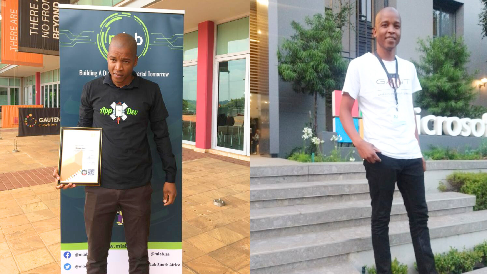
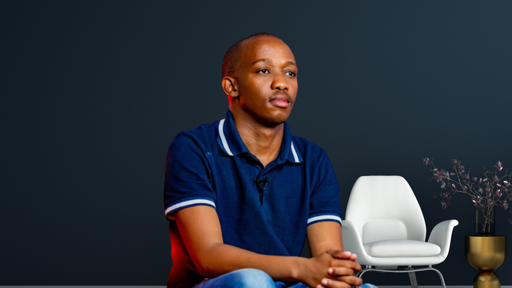

Temosho Shaku, a graduate of mLab’s CodeTribe Academy, is making waves in the tech world with his impactful work at Mansalema Enterprise. Since joining the startup as a developer, he has played a key role in building Salema, a mobile app designed to combat Gender-Based Violence (GBV). His work is not only driving social change but has also gained major recognition, Salema has been nominated for the FNB App of the Year 2024 and was showcased at the YALI Alumni Expo & Trade Show 2024 in Cape Town.

The Salema app allows users to send an emergency alert by simply shaking their phone. The app notifies three pre-selected emergency contacts and Mansalema’s office, where drones are deployed to locate the person in danger, track perpetrators, and notify the police. The app is available to download on the [App Store](https://play.google.com/store/apps/details?id=com.maduane.salema&pcampaignid=web_share). 

Mansalema Enterprise was founded in 2020 by Morelokolodi Mankuroane during South Africa’s hard lockdown, a time when gender-based violence (GBV) was (still) a major crisis. 

Temosho joined CodeTribe in 2023 and graduated in early 2024. While working on such an important project at Mansalema Enterprise, he faced challenges like anyone else would, such as debugging, integrating IP systems, and deployment issues. However, his experience from CodeTribe gave him the skills and confidence to overcome those obstacles. Reflecting on his journey, he said,  "Now, I can develop an app from beginning to end."

Temosho credits much of his growth to his time at CodeTribe Academy, where he honed his skills in software development and problem solving. “CodeTribe taught me to build with purpose, now I’m using tech to make a real impact,” he shared. 

Mansalema’s CEO Morekolodi said that having Temosho on this team has been a game changer for Mansalema Enterprise.”His skills and dedication have played a big role in developing and improving the company’s technology solutions. From troubleshooting complex issues to integrating new systems and ensuring smooth app functionality, he brings a problem-solving mindset that keeps projects moving forward,” he added.

\
Mankuroane believes that what makes Temosho a great team member is his strong work ethic and positive attitude. He is always eager to learn, share ideas, and support his teammates. No matter how difficult a task is, he approaches it with confidence and determination.

Temosho’s journey is a testament to the impact of mLab’s CodeTribe Academy in nurturing young tech talent and preparing them for real-world innovation. His story highlights how skills learned at CodeTribe don’t just shape careers, they contribute to meaningful change in society.