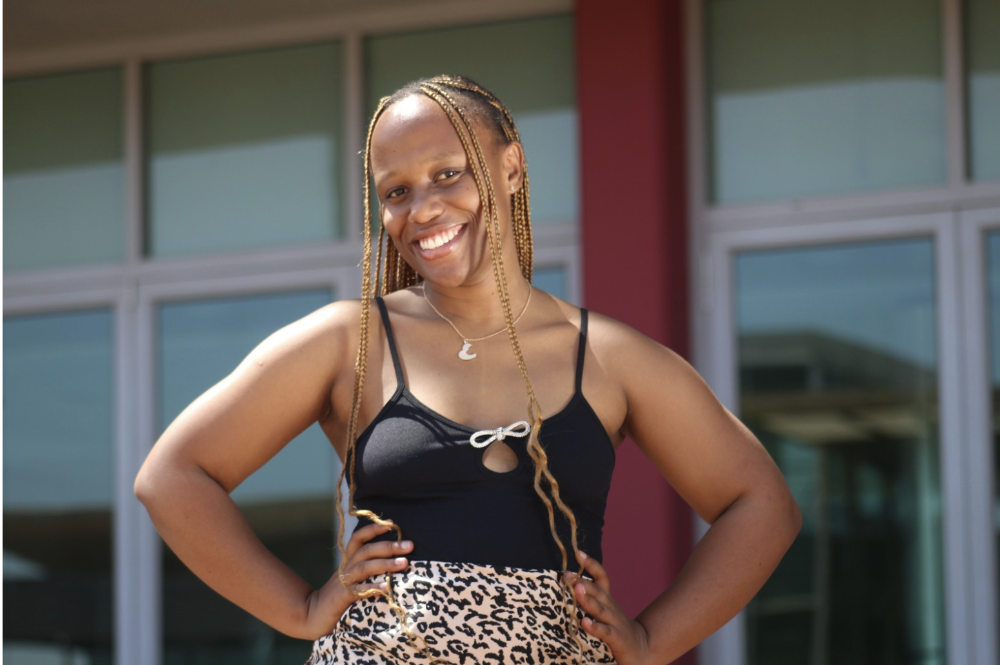

We’re proud to announce that Khensani Ebenezer Lebese, a recent graduate of our CodeTribe Academy, has joined Mbula for a 12-month placement to gain real industry experience.

Khensani graduated in April this year, and her new role at Mbula will give her hands-on exposure to the tech industry. Over the next year, she will be involved in:

* Designing, developing, testing, and deploying software and hardware solutions
* Web, server-side, database, and mobile development
* Business operations and technical documentation

[Mbula](https://mbula.co.za/) is a forward-thinking tech start-up that brings digital innovation to life.The company focuses on building a connected world of people, devices, and cloud-based platforms. With a fresh and unbiased approach, Mbula helps businesses assess their current innovation strategies and guides them in turning bold ideas into real, impactful projects.

Khensani says she feels confident stepping into this opportunity because of the strong foundation she built at CodeTribe.

“This new opportunity is an exciting step forward in my career, and I feel prepared thanks to my time at CodeTribe. The programme equipped me with valuable technical and professional skills, especially through the Scrum and interview workshops. These sessions gave me the confidence and practical tools to excel in interviews and present myself effectively in team-based environments,” she shares.

Her path is also powered by the people who believe in her.

“My biggest motivation comes from my family, especially my parents, who have always believed in me and supported my dream of becoming a software developer. Their constant encouragement has been a strong foundation for my journey, and the belief they’ve shown in me has given me the confidence to pursue my goals fearlessly.

I’m also inspired by the people around me, friends, mentors, and peers, who constantly remind me that I am capable of more and who continue to push me to grow beyond my limits.”

We are eager to see where this next chapter takes Khensani, and we know she’ll make the most of it. 

**Contact us** on info@mlab.co.za to get digitally skilled talent like Khensani.