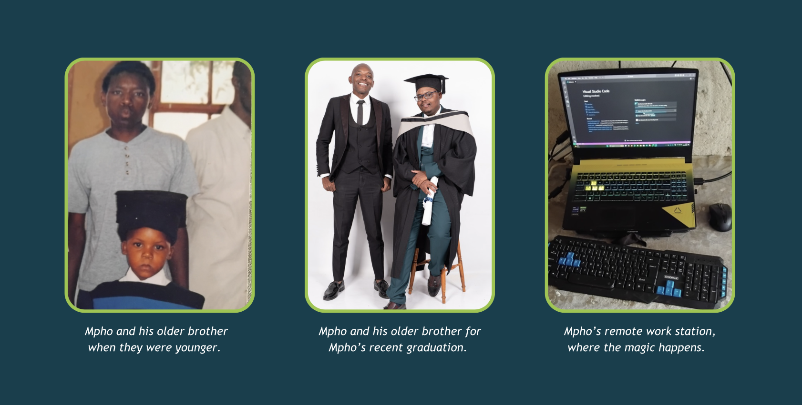

Sometimes, being naughty helps one practise and strengthen their muscles. Mpho is a testimony to this. From just being interested in gaming and always messing around with his big brother’s computer, he found his career interest, which is technology. Exactly 14 years ago, dating back to the 2010 Fifa World Cup, the mischief in Mpho was brewing. 

Fast forward to when Mpho had to make a choice of what to study in tertiary, it’s quite obvious that he’d go the tech route. He studied Information Technology Multimedia at the Tshwane University of Technology (TUT), and it was right after completing his studies that a good friend of his told him about our CodeTribe boot camp. Mpho came to our boot camp with his friend, little did he know that he’d end up being a coding skills trainee at Codetribe. 

Talking about his experience at CodeTribe, Mpho said that he now has the practical skills and style of thinking to survive in the world of work. “At CodeTribe, we were not spoon-fed but we got empowered and as a result, I get to use that experience when I deal with clients in my job”, he said. 

Mpho is now a Developer at Naledi 3D Factory, a company that uses Virtual Reality (VR) to teach and explain concepts across different fields. They create VR experiences for industrial training, safety awareness, health and sanitation, heritage, and new technology. Their work also helps with community development by using VR to share useful information and practices.

### This is just the beginning of his greatness 

Change is naturally a challenging dynamic for humans, and like anybody else Mpho had a very interesting transition from graduating at CodeTribe to working full time. He did not anticipate the number of presentations that the world of work would ask of him, but “At CodeTribe, we did soft skills training too, so that experience has helped me to be able to articulate myself when making presentations at work”, he noted. 

One of the greatest things about being at CodeTribe is that, one gets the chance to build a network of like-minded people. Mpho calls his fellow CodeTribe graduates when he faces coding challenges at work, “I found a community at CodeTribe like I met other Coders from different parts of Gauteng and because of that I don’t get stuck with work issues and not have someone to call”, he said. 

Another interesting dynamic in Mpho’s transition from CodeTribe to his current role is working remotely. “Yoh! This one requires discipline, I watch my time these days and sometimes my friend comes to hang out during work hours and I would have to remind him that I am actually working but ***from home***”, he laughed. 

### From Mpho to you 

“When it comes to joining CodeTribe, I would say do not focus on the paycheck. When some of us started at CodeTribe we were looking for the highest bidder. But look at the value that you will get from there”.