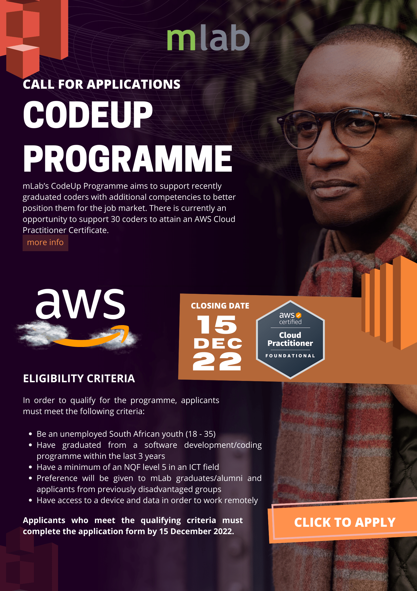

##### Introduction

Developing digital talent, innovative technology and successful entrepreneurs are the pillars on which Africa will build a prosperous and sustainable future.

This is why mLab supports young innovators, founders, next generation coders and digital creatives to build Africa’s digital future. mLab believes that when our youth are empowered with the right skills to innovate and create solutions, they unlock opportunities for new ventures that will drive our economies forward.

The CodeUp Programme aims to support recently graduated coders with additional competencies to better position them for the job market.  There is currently an opportunity to support 30 coders to attain an AWS Cloud Practitioner Certificate.

##### Programme Outline

In order to qualify for the programme, applicants must meet the following criteria: 

* Be an unemployed South African youth (18 – 35)
* Have graduated from a software development/coding programme within the last 3 years
* Have a minimum of an NQF level 5 in an ICT field
* Preference will be given to mLab graduates/alumni and applicants from previously disadvantaged groups
* Have access to a device and data in order to work remotely

##### How to apply

Applications must be submitted before 15 December 2022, 4pm.

Complete the application by clicking on this link: <https://bit.ly/CodeUP23>