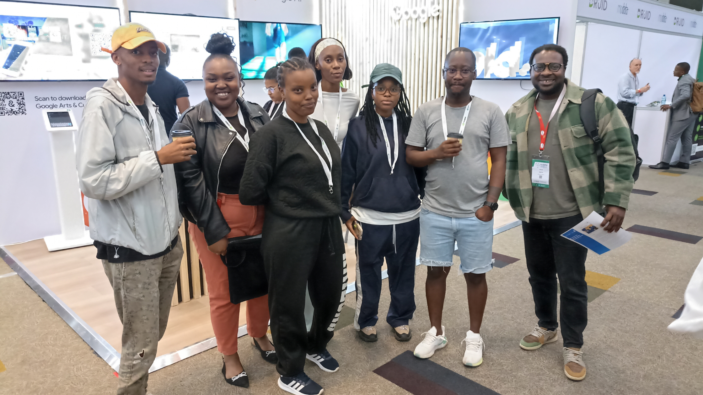

mLab and The Innovation Hub, the innovation agency of the Gauteng Province and a subsidiary of Gauteng Growth and Development Agency strategically tasked with driving innovation and entrepreneurship in Gauteng have joined forces to launch an exciting new pilot training programme in data annotation for unemployed youth based in Soweto, Gauteng. 

This initiative has contracted 20 young people from Soweto, who are currently undergoing hands-on training at the eKasiLab in Soweto. Over the next six months, these trainees will receive essential skills in data annotation, all while receiving a monthly stipend.

Nicoli Koorbanally, CEO of mLab, explains that, "Collaborations like this are key in addressing the gaps in the digital innovation ecosystem, and this partnership facilitates the upskilling of youth in 4IR technologies, which is central to mLab’s mission of empowering young people to transition into productive citizens in the economy.” Each trainee holds an NQF level 6 qualification in fields such as Computer Science, Information Systems, Software Development, Data Science, and related ICT fields, ensuring they have the foundational knowledge to excel in this programme.

Gopolang Setumo, The Innovation Hub's Senior Manager in Skills Development, adds, “Data annotation aligns with our focus on ‘Skills Development for Innovation and Entrepreneurship,’ aimed at equipping unemployed, township-based youth with relevant skills. This training gives them the chance to participate in the mainstream economy, whether by starting their own businesses or securing jobs.”

Palesa Antony, mLab's Technology Ecosystem Lead, who is instrumental in managing this programme, explained that data annotation is the process of labelling data, like images, videos, or text, to make it usable for artificial intelligence and machine learning. This programme's curriculum covers data labelling techniques, basic programming, quality assurance, and using data annotation tools. 

“40% of the current trainees are female, and we’re eager to see this number grow as we strive for greater gender diversity in our programmes. After completing the training, trainees will be well equipped for career opportunities, such as data annotation specialists, quality controllers, or even AI data trainers”, She added.

**For enquiries: [press@mlab.co.za](mailto:press@mlab.co.za)**