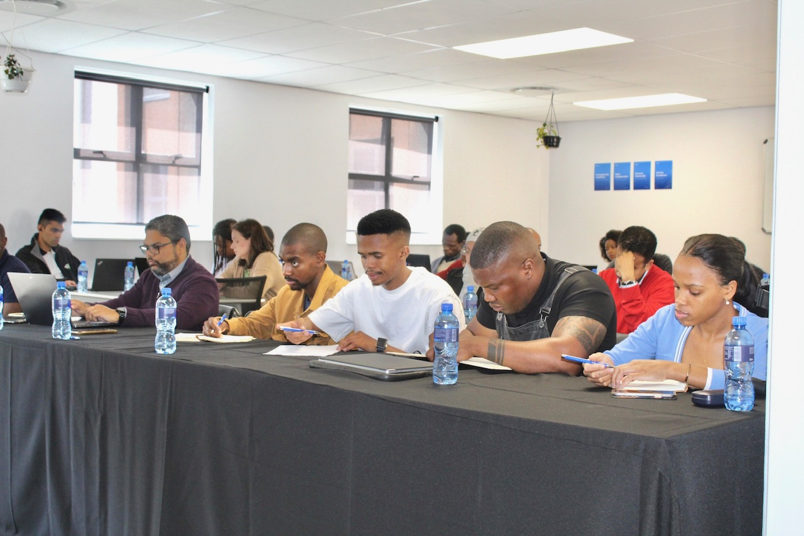

Following the attendance of the SA Innovation Summit in Cape Town on 28 - 29 September, these 4 entrepreneurs who pitched their businesses alongside six other competitors have been selected to go compete against other African startup innovators in Kenya, at the [Africa Startup Ecosystem Builders Summit and Awards ](https://asebsummit.com)(ASEB). 

These budding entrepreneurs pitched their businesses to a panel of judges, out of the ten participants, four were chosen as the cream of the crop. Bophelo, a medication adherence platform that simplifies living with chronic illnesses by reminding patients to take their medication on time, took position one. 

Taking the number two spot was [Passwordkid](https://passwordkid.co.za), a child safety company that ensures that kids are safe when they attend and leave school. Chemyx was spotted on number three, a farming, agri-processing and manufacturing company that uses essential oils and other raw materials to produce organic cleaning products and cosmetics. Adia Cosmetics, the manufacturer of organic and handmade skincare products took position four. 

###### Navigating the demanding journey of business pitching 

Pitching a business in front of a panel of judges and a major audience is not so simple but it is important to take away lessons learned from it to improve your pitching skills as an entrepreneur. 

“I've learnt the power of community and identifying how we all fit in in this ecosystem to achieve formidable change to positively impact many lives”, said the founder of Adia Cosmetics, Ayanda Nyandeni. Lebogang Rosemary Ramonetha, the founder of Chemyx added that she appreciates all the feedback from the judges because it has boosted her confidence. Passwordkid’s founder , Keletso Lekwakwe highlighted that the judges enlightened him on how to approach the pitching game when looking for funding or partnerships. 

“We will also share these critical skills with other startups who may be at a lower technology readiness level (TRL) and require support to grow”, said Mxolisi Booi the founder of Bophelo. 

######  Look at the power of partnerships 

This success story would not have been possible without support and trust of The[ Department of Science and Innovation](https://www.dst.gov.za) (DSI) and the [Technology Innovation Agency](https://www.tia.org.za) (TIA), who played a pivotal role in empowering mLab to implement the BoostUp startup support programme, enabling these entrepreneurs to reach new heights.

We would also like to express our heartfelt gratitude to the [South African Innovation Summit](https://innovationsummit.co.za), [the Southern Africa Innovation Collective](https://www.sainnovationcollective.org) (SAIC), and [Setup A Startup](https://setupastartup.org) for their invaluable contributions to this transformative programme.