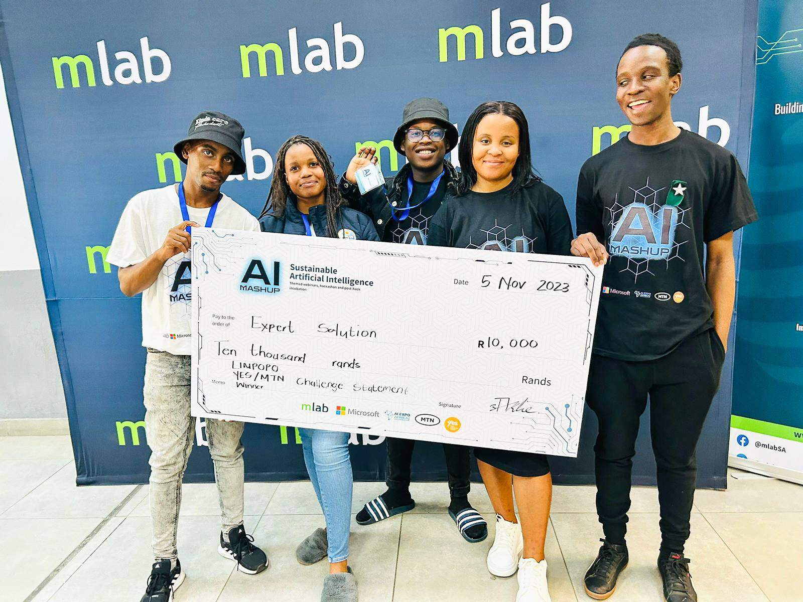
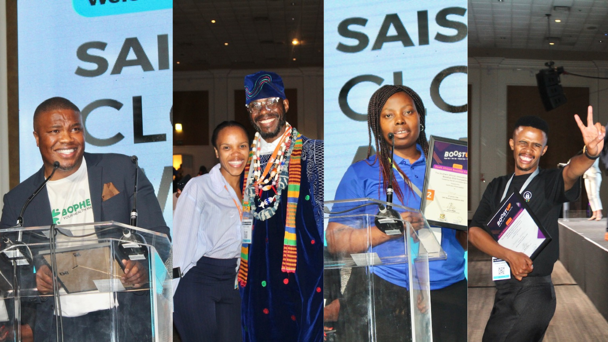

First of all, we wish you a merry Christmas with lots of love. Before we also go to enjoy our summer days, tables groaning with food and good company, we thought we should share some of our highlights from the last quarter of 2023.

Like any normal company or individual, we faced challenges this year but we had more exciting moments.

##### Our AI Mashup: The biggest AI-themed hackathon 

You might have seen campaigns on our social media and other marketing platforms about this one: the biggest AI-themed hackathon, which we called the AI Mashup. 

In partnership with Microsoft and the AI Expo Africa, sponsored by the MTN Group, the Youth Employment Service (YES), and Microsoft, we simultaneously hosted this AI-themed hackathon in Gauteng, Limpopo, Kwa-Zulu Natal and in the Northern Cape.

At the hackathon, youth were given problem statements to solve using Microsoft AI services, while contesting to win cash prizes. This was such a big event that required lots of planning, commitment, and many hands on deck. 

National winners of the AI Mashup received R50,000 each and are set to receive business development support worth R20,000. Provincial winners also walked away with R10,000 each and are now officially part of our community where they will be able to explore future opportunities. 

##### We went around SA to find innovative entrepreneurs to empower 

We kick-started one of our startup support programmes, BoostUp. This programme is essentially a three-part startup support programme organised by the Southern Africa Innovation Collective (SAIC) in Botswana, Namibia, South Africa, Tanzania, and Zambia. It targets budding startups that use technology and innovation to solve societal challenges. 

At mLab, we help entrepreneurs refine their ideas, train them on how to pitch their business ideas, and provide them with resources to grow their businesses. 

We travelled to Mpumalanga, Limpopo, Kwa-Zulu Natal and the Northern Cape to find these entrepreneurs, which we trained and later got an opportunity to pitch their businesses at the 2023 SA Innovation Summit in Cape Town. 

About 4 of them were chosen to go pitch on a global platform, the Africa Startup Ecosystem Builders Summit & Awards (ASEB) in Kenya. We are proud to be able to give them opportunities to network and grow.

It is with pleasure to also share that our other Limpopo-based Agriculture and Tourism startup support programme, AgriTourZA won an award at the ASEB Awards, as the Startup Ecosystem Initiative of the Year. 

##### New projects and partnerships

In partnership with Path, a US-based organisation that advances health through innovation and partnerships, we opened a call for applications seeking digital health solutions for HIV/TB healthcare in South Africa. 

Two grants valued at R1.2 million each will be granted to budding startups and university entrepreneurs whose proposals get accepted after careful consideration. You may read the full call [here](https://mlab.co.za/news/call-for-proposals-from-startup-phase-enterprises-to-develop-digital-health-solutions). 

In other exciting news, we will be taking in the second cohort of beneficiaries for our short Internet of Things (IoT) programme, that we host in Kimberley in the Northern Cape. We extend our utmost gratitude to the Media, Information and Communication Technologies Sector Education and Training Authority ( MICT SETA), for partnering with us on this project. 

##### Recognition from the 2023 IITPSA President’s Awards 

Our incredible CEO Nicoli Koorbanally was nominated for an IITPSA President's Award in the Social Responsibility/Community Award category.

We think of this nomination as an acknowledgment of the hard work and dedication that our CEO and the entire mLab team put into facilitating all our digital skills and startup accelerator programmes. Therefore, we appreciate this kind of nod. 

##### Happy holidays and Merry Christmas to all

Once again, thank you to our highly esteemed stakeholders for your unwavering support and our programme beneficiaries for trusting us to empower you. 

May the mLab team also have a restful festive season. 

A great 2024 awaits us all, stay Blessed.