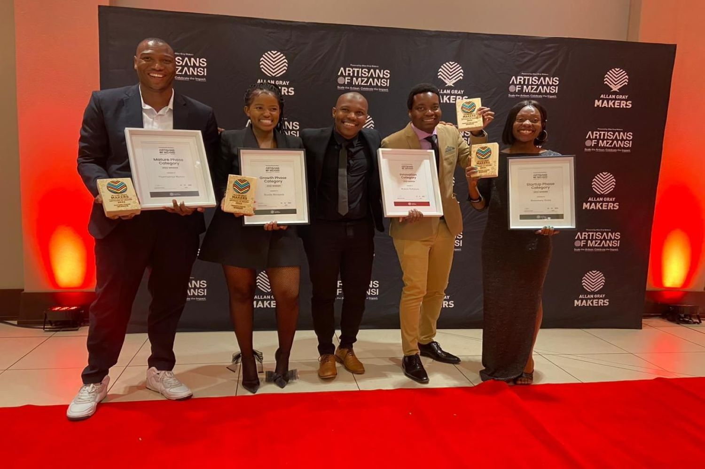

Back in 2018 while studying Electrical Engineering at Mopani South East TVET College, Ratlabala had a realisation that most industries use power ineffectively, and as a result, it gets lost. So, he wondered, isn’t there a way to solve this problem?

“I then came across a boot camp opportunity by Red Bull called the Red Bull Basement and I applied for it”, he said. The Red Bull Basement is a 2-month boot camp programme that empowers student innovators to kickstart their ideas using technology to drive positive change. The aim is to connect and inspire all students to constructively challenge the status quo and make positive impacts. 

Ratlabala’s idea was to develop a technology that would be able to take electrical data from equipment, use it to manage the electricity, and lower power consumption. At the end of the Red Bull Basement boot camp, he had proof of his concept which he says was advantageous for him to get into the mLab StartUp Programme, in late 2019. 

Then, Learn Base pty (LTD) was born. 

#### A mark of honour: Ratlabala wins an Allan Gray Makers Award

On 10 December 2022, Allan Gray Makers hosted the Artisans of Mzansi Celebration Awards. 

These awards shine a spotlight on African Artisan Makers to encourage more young people to join the technical and vocational trades to create meaningful employment opportunities in their communities.

Ratlabala won R100 000 for his business, under the Innovation Phase category.

#### Effort on his part, going for it and finding the opportunity.

, Mokete Ratlabala.")

Ratlabala was determined to get his business started, and he knocked on many doors to do so. “I was looking for resources to develop this product, so I approached a couple of organisations including mLab and TIA”, he said. TIA is the Technology Innovation Agency. 

As a result of all the effort he put in, he secured some funding to develop his prototype into a commercially viable product and to also pilot test it. 

“mLab will also provide support by building a mobile application for the project and allow me to use their office resources”, he added. 

Five years later, Ratlabala will be pilot testing his product, beginning this year up until the end of 2024. He will be working with a couple of institutions amid this time, including Polokwane Municipality, France Mohlala Secondary School, Kuschke Agricultural Secondary School, and Moshakga Primary School. 

#### ‘If it does not work out, no big deal, try again.’

Advising aspiring and budding entrepreneurs, Ratlabala said, “if you are going to start a business, do not think it’s going to take-off quickly”. 

He asserts that entrepreneurs must be patient with their journeys even if they are not making a ‘big bank’. “If it does not work out, no big deal, try again”, he added.