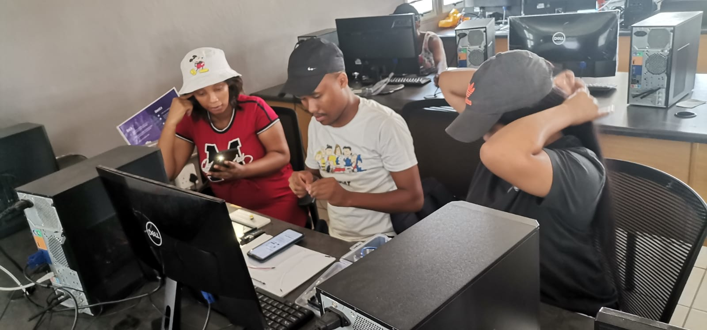
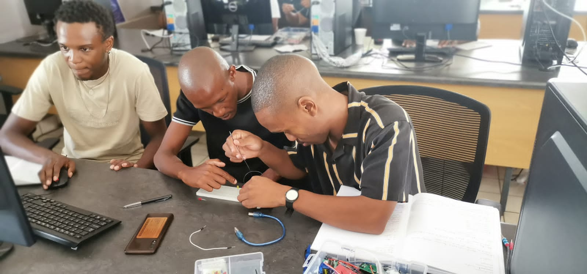

A partnership between mLab and the Media, Information and Communication Technologies Sector Education and Training Authority (MICT SETA) was established through the signing of a Memorandum of Agreement in 2022, to empower South African youth with skills that are necessary in the Fourth Industrial Revolution (4IR)  and beyond.

mLab, with support from the MICT SETA, is implementing a 3-month Internet of Things (IoT) training programme in Kimberley in the Northern Cape.  Fifteen young people, 40% of whom are female, are participating in this stipend paid programme. Statistics show that only 23% of women in SA hold jobs in ICT, this women-led programme is one of the few initiatives aimed at empowering females because they cannot afford to be left behind in this industry.

“Industries in the Northern Cape, such as mining and transportation could improve productivity and efficiency by using IoT technologies, and thus the skills that we are building could be attractive to employers in the region,” says Palesa Antony, mLab’s Coordinator responsible for the partnership with the MICT SETA.   MICT SETA's Senior 4IR Manager, Gugu Sema, says that those youth that are participating in the programme will be at an advantage when work opportunities arise as they would be possessing a cutting edge skill that’s  required by most employers. 

## What is the Internet of Things and why is it important?

IoT has become one of the most cutting-edge technologies of the 21st century. 

Today, almost every person owns an item that is based on connected technology as a result of IoT. IoT is defined as the network of physical devices or things that are installed with sensors, software, and other forms of technology to connect and swap data with other devices over the internet. 

The world is now more connected, and it's changing how we live, work and play. It is thus essential to equip our citizens, especially the youth, with both knowledge and skills to enable them to productively participate in this digital economy. 

## The potential impact of the Internet of Things 

Youth unemployment, heightened by a mismatch in digital skills that are sought after in the industry, is a major crisis in South Africa that needs to be addressed. This programme is an attempt to close this skills gap. 

Antony, who is playing an instrumental role in implementing the programme, says she is hopeful that the trainees will be able to identify entrepreneurial opportunities with these new skills, and go on to develop innovative solutions to solve challenges in communities around them.  The electricity crisis is an example of a challenge that is desperately in need of solutions.  “The current focus is for the trainees to learn about IoT opportunities that exist in industries such as mining, healthcare, manufacturing, logistics, and agriculture to name a few", says Antony.

According to [Mordor Intelligence](https://www.mordorintelligence.com/industry-reports/south-africa-iot-market), South Africa's high internet user rate is likely to contribute to the market growth of IoT. Many industries in the country have adopted IoT technologies, including retail and automotive. Such rapid growth and technological advancement will create a demand for talent, thus being skilled in IoT is important.