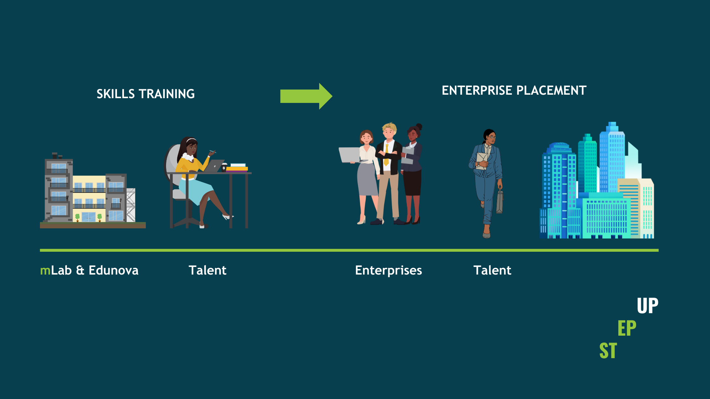

[mLab](https://mlab.co.za/) and [Edunova](https://www.edunova.org/) have joined forces to launch Step Up (Skills Training & Enterprise Placement to Unleash Potential), a new programme designed to equip youth who are not in employment, education or training (NEETs) with the skills and opportunities needed to enter the digital economy. 

The Collective X (TCX), through the Jobs Boost Programme, has appointed Edunova and mLab to bring the Step Up programme to life. Edunova, a specialist in digital skills training, will equip participants with essential digital literacy, cloud computing certifications and career-readiness soft skills, over a period of 6 months. Meanwhile, mLab, a non-profit organisation that assists youth and entrepreneurs to thrive in the digital economy, will act as the employer partner, placing the trained youth into small and medium-sized businesses (SMBs) within its network, for 12 months.

The opportunity for young adults to receive training was advertised on the SA Youth platform which is part of the Presidential Youth Employment Initiative (PYEI). There were an impressive 3 107 applications, highlighting the strong demand for programmes like this. 

A total of 17 young participants have joined this journey to become System Administrators, eager to transition from learning to earning. The programme is currently being hosted at Edunova’s Digital Learning Hub in Daveyton, Gauteng. Currently, 59% of the participants are female and 41% are male. During recruitment, more young women showed interest, making up 74% of applicants, with males accounting for 26%. These numbers again emphasise the strong demand for opportunities among young women and the growing interest in digital skills among young people.

Inspired by South Africa’s high youth unemployment rate, Step Up aims to create a bridge between young talent and the growing needs of small and emerging businesses. Through this partnership, mLab and Edunova are taking bold steps towards a future where an increased number of young people have access to meaningful work and more SMEs have the talent they require to succeed. 

“With the  understanding that SMEs play a crucial role in tackling unemployment in South Africa, through Step Up, they will  become a  bigger  part of the solution," said Gugu Nkosi, Project Manager at mLab. “At the same time, these businesses will gain fresh talent with digital skills, to help them work smarter, scale faster and boost their growth. It is a win-win for both young people and the SMEs driving our economy forward,” she added. 

Edunova’s National Implementation Manager, Ziphelele Mdlalo, is confident that  the organisation’s experience in running educational and skills programmes will help make this initiative successful. She added excitedly, “With our experience in training, technology and working with young people, we are making sure that Step Up is both effective and sustainable. For the youth, we provide skills and real work experience to help them become more employable. For SMEs, we offer support on how to utilise digital tools to improve their businesses.”

The two organisations look forward to sharing more about this pilot initiative that launched at the end of January 2025. Both mLab and Edunova are keen to explore how they can partner with more like-minded organisations in order to provide similar life-changing opportunities to both unemployed youth and SME entrepreneurs across South Africa.

**For enquiries: press@mlab.co.za or zukanye@mlab.co.za**