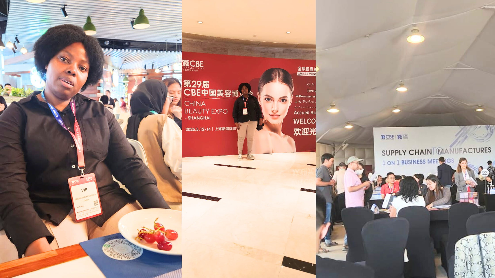

Founder of a startup company called Chemyx, Lebogang Rosemary Ramonetha attended the China Beauty Expo, which is one of the largest and influential beauty trade shows in the world. Held in Shanghai, from 12-14 May 2025, the expo brought together over 3,200 exhibitors, beauty stores, chain stores and related professionals from more than 80 countries. 

Lebogang’s Chemyx, founded in 2014, is a company that manufactures natural, plant-based and eco-friendly cleaning products, including organic cosmetics such as essential oils, organic skin and hair capsules, and dried herbs. Chemyx aims to promote eco-friendly practices through organic farming and natural products, integrating biotechnology, agro-processing, and manufacturing.

Organisers of the World Buyer Summit invited Lebogang to attend the China Beauty Expo (CBE), which she says provided her with a platform to connect with entrepreneurs from all over the world, and to explore new business opportunities.

Back in 2023, Lebogang joined one of our startup support programmes BoostUp, which is designed to help accelerate early-stage startups in Southern Africa. This programme is organised by the Southern African Innovation Collective (SAIC) and implemented by us, and in partnership with other hubs like the Technology Innovation Agency (TIA). 

We are proud of Lebogang’s journey, it’s amazing to see her get the chance to network on such a big global stage. During the China Beauty Expo, she  had the chance to meet with other entrepreneurs, building valuable connections and exploring exciting new partnerships.

Lebogang is currently part of our enterprise development programme, where she continues to grow her business. When our brand team asked what’s next, she excitedly shared,  “I’ll be launching a business app soon, it will help detect skin problems and connect users to dermatologists and skincare product providers,” she said.