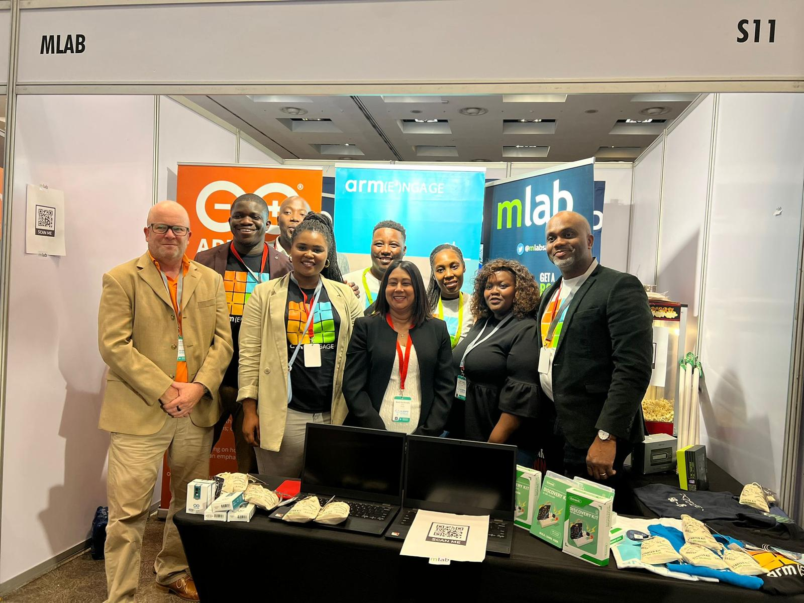

High youth unemployment compounded by a lack of access to digital skills and resources is among some of the major challenges that need to be addressed to bridge the inequality gap in South Africa. This is because technology has been identified to have the power to help level the economic playing field, facilitating more and better access to money and access to jobs. 

The new partnership between the United Kingdom-based firm, Arm, and Mobile Applications Laboratory (mLab) in South Africa, aims to disrupt the local skills development landscape by enhancing access to hardware, software, digital tools, and training opportunities.  

The partnership was announced on 19 September 2022 at the AI Expo Africa event which was hosted at the Sandton Convention Centre. AI Expo Africa is the largest business-focused Artificial Intelligence (AI), Robotic Process Automation (RPA), and 4IR trade event in Africa, uniting 1000s of buyers, suppliers & innovators across the region. The partnership announcement attracted interest from various practitioners in the Information Communications and Technology (ICT) sector. 

As part of the signing ceremony Stephen Ozoigbo, Emerging Economies Senior Director at Arm stated,  “The partnership with mLab enables Arm, and its partners to significantly contribute towards the digital skills revolution by providing access to cutting edge technologies needed to catapult South Africa’s progress in the fourth industrial revolution (4IR)”.   

He continued to say, “Learners across various age groups and capabilities will get the opportunity to play and experiment with these resources that could build their interest in pursuing maths, science, and technology-related subject choices and career paths in the digital economy.”  These resources include various forms of hardware devices and learning kits from Arm partners such as Arduino and Microbit.  

Nicoli Koorbanally, CEO of mLab said, “When the prospect of holding, building, and testing technology can be realised at a young age, it can spark creative thinking, an entrepreneurial mindset, and the motivation to build innovative solutions that can solve local challenges.” She added that “Closing the skills gap, and developing this calibre of digital talent is what mLab wants to supply into the South African economy”.  

The partnership will primarily benefit mLab’s Ecosystem Acceleration offering that focuses on building a pipeline of digital talent for its Skills and StartUp Accelerators.  Ecosystem activities include short 4IR training, digital literacy, school robotics, and coding workshops amongst other programmes. 

In addition to providing mLab programme participants with training kits, laptops, and software licences, the agreement with Arm also seeks to provide access to international initiatives for talented local youth and establish a Technology Hub with mobile digital labs (Lab in a Box) that will be able to service remote locations and communities. 

With over 10 years of experience in delivering impact, mLab is known for having a strong focus on empowering youth, women, and previously disadvantaged communities. The partnership with Arm is envisioned to aid in this endeavour by fostering a conducive learning and development environment for South Africa’s youth.

**For media enquiries contact** [zukanye@mlab.co.za](mailto:zukanye@mlab.co.za)