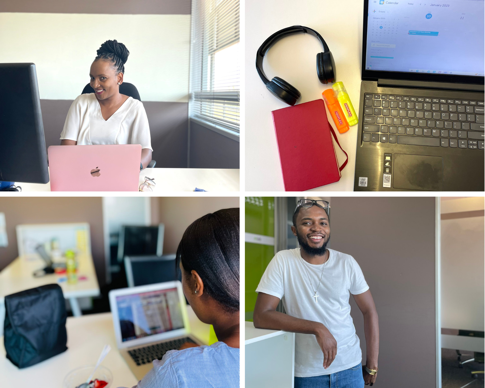
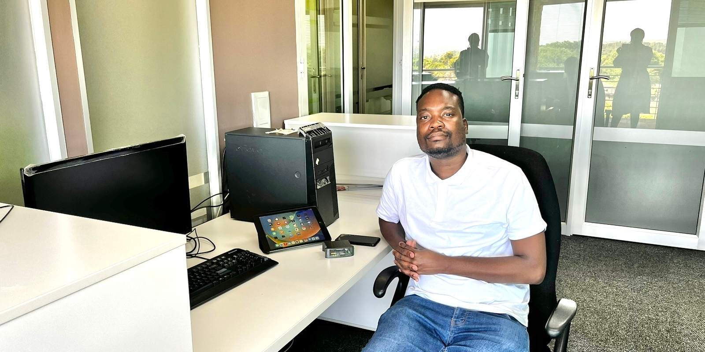
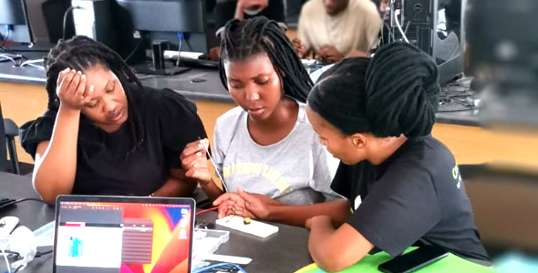
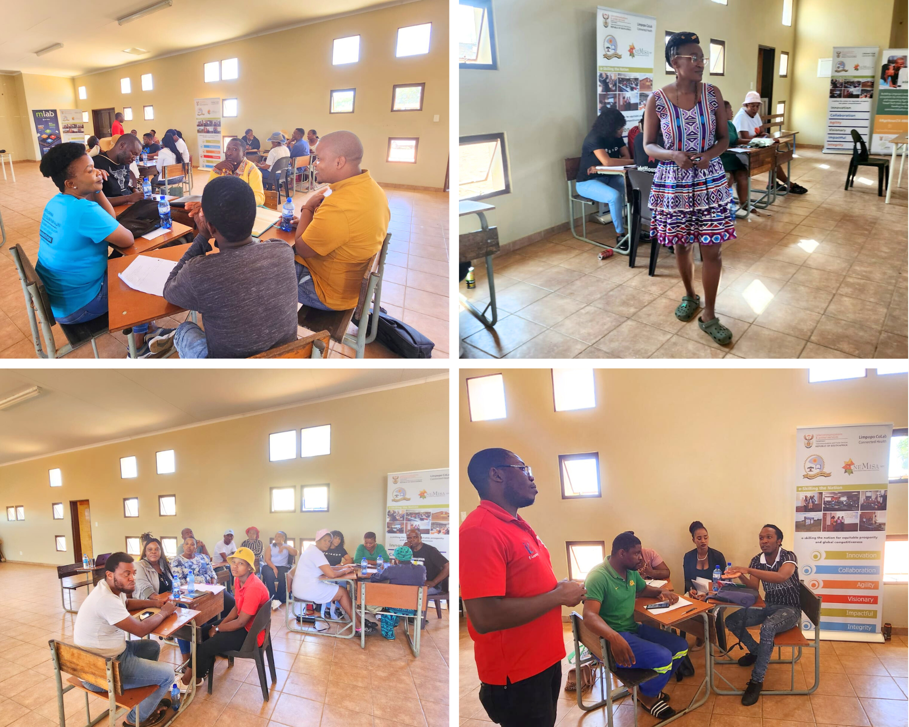
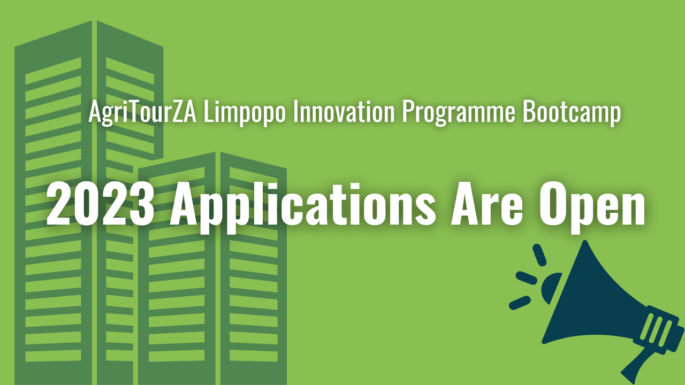

The United Nations declared 2023 the International Year of Millets to raise awareness of the crop's climate-resilience and nutritional benefits.  On 10 January the mLab family returned to work after spending quality time bonding with loved ones, and taking time to re-energise. 

Good self care and resilience are essential for our team to function productively, and so the theme for 2023 is quite relevant in our environment. Our well-earned holiday helped us return to work feeling rejuvenated and ready to do great things in 2023.

## **SA’s youth are at the top of our agenda. We opened calls for applications to attend our CodeTribe Bootcamp.** 

When youth are empowered with relevant skills, it boosts their capabilities, self-worth, and determination. Developing advanced digital skills is core to our CodeTribe Academy.  The entry point to the academy is participation in a CodeTribe Bootcamp.  Calls for the 2023 cohort were issued in December 2022. 

The bootcamp runs annually in February, over 4 weeks, during which participants receive training in different programming languages and basic web development with an emphasis on closing any skills gaps and levelling competencies . 

Our bootcamp runs virtually with physical meetups hosted at our regional offices in Limpopo, Gauteng, and in the Northern Cape. Over 600 applications were received for the entrance into our coding academy for 2023.

## **A success story to warm the heart: mLab start-up wins an Allan Gray Makers Award**

It is always heart-warming to watch mLab start-ups progress to their next growth opportunity and for being recognised for their hard work. Mokete Ratlabala, the CEO and Founder of Learn Base, a start-up incubated in mLab’s StartUp Accelerator programme in 2019, won an Allan Gray Makers Award in December 2022.  Learn Base developed a technology that sources electrical data from equipment and utilises it to manage electricity use, and to lower power consumption.

The Allan Gray Makers Awards encourage young people to join the technical and vocational trades to create meaningful employment opportunities in their communities.

Ratlabala won R100 000 for his business, under the Innovation Phase category. [[Read More]](https://mlab.co.za/news/Learn-Base-pty-(LTD),-a-startup-incubated-by-mLab-wins-Allan-Gray-Makers-Award-and-is-set-to-pilot-its-product.)

## **We launched an Internet of Things (IoT) 3-month short course**

Following a collaborative partnership established between mLab and the Media, Information, and Communication Technologies Sector Education and Training Authority (MICT SETA) , mLab recently launched a short training course for youth in the Northern Cape on the Internet of Things (IoT).

The 3-month training programme is being implemented in Kimberley  with fifteen young people, 40% of whom are female, participating in this stipend-paid programme. [[Read More](https://mlab.co.za/news/MEDIA-STATEMENT-mLab-delivers-a-short-Internet-of-Things-training-programme-to-develop-work-ready-youth-for-the-digital-economy)]

## **More exciting news: our new website has been launched**

We love continuous improvement, and with the idea of a 'new year, new look' approach, we improved the mLab website which launched in February. The new version speaks to our targeted youth in a more relatable manner, better describes mLab offerings, it has fresh  content and latest news.  

We hope that you will also enjoy the new look and feel of the website, as well as the ease of navigation. We are also really excited about our ChatBot, Palesa, that enhances engagement with us.

## **A February filled with training sessions to empower entrepreneurs**

Digital technology and media have disrupted the business industry, moreso after the Covid-19 pandemic. This era of digitisation has propelled businesses to find innovative and creative ways of engaging with their customers.

Small businesses must adapt to new customer behaviour, and leveraging the power of digitisation could significantly enhance their business success. In partnership with the National Electronic Media Institute of South Africa, mLab hosted training sessions on the 'Introduction to Digital Entrepreneurship' in Gauteng and Limpopo. 

These training sessions were both online and physical, and we touched down in Ga-Rankuwa, Tzaneen, Westernberg, and Mokopane, just to name a few locations. 

## **More Than A Woman**

\
On International Women’s Day we celebrated female innovators at the ‘More Than A Woman’ showcase, hosted by [Global Alliance Africa](https://iuk.ktn-uk.org/programme/africa/). 

More Than A Woman is an exciting project pitch session where women innovators would share their ideas with a gathering of investors, ecosystem enablers, and support organisations from across the UK and Africa, to help them scale their solutions to the world.

We are proud to have partnered with [Innovate UK KTN](https://iuk.ktn-uk.org/) to make an event like this happen. “These women shine the light for our young girls who are curious about innovation and entrepreneurship”, said our CEO Nicoli Koorbanally.

## **Coming up next…**

Application calls for our AgriTourZA regional innovation support programme are currently open. We are looking for innovative entrepreneurs in Agriculture and Tourism to support and nurture their businesses to reach the commercialisation stage, to view the qualifying criteria and to apply [[Read More](http://bit.ly/3Mzrf3A)].