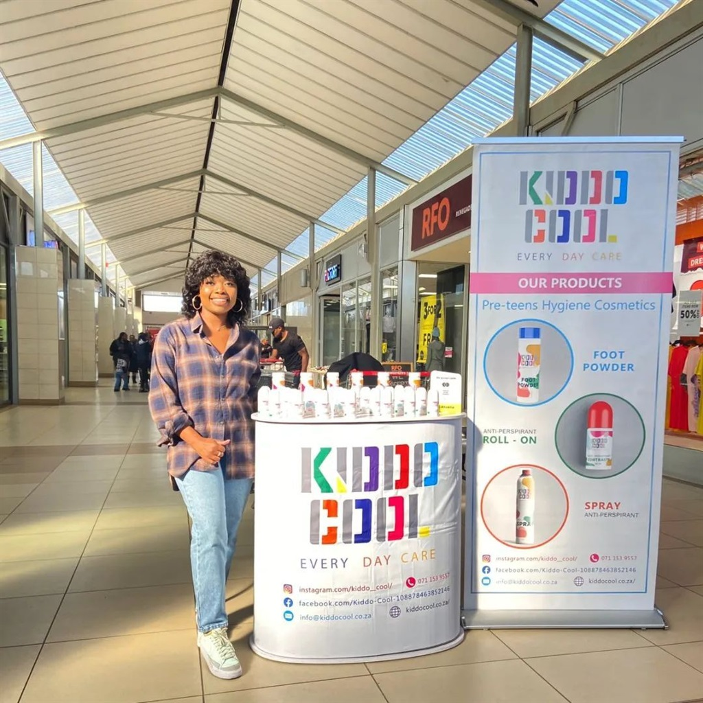

Raised by a single father in the City of Tshwane who was a businessman, Mapula Ramothwala watched her father manoeuvre the business world and could not help but be inspired by him. Observing her father's tireless moves in business to provide for his children made her realise that she wants to be a businesswoman. 

She has a passion for working with young children which she says drives her to create businesses that solve problems that affect children. Her first business concept was to develop an identification tool to be used to identify young children in schools. "The higher education system has identification tools like student cards but pre and primary schools don't and should any kind of accident happen, identification of those involved would be difficult", she said. 

Unfortunately, she could not get this business idea off the ground, she then identified a different issue to solve. She mothers a young boy who plays soccer whom she says had body odour issues and she could not find products that were suitable for his age group. From conducting research it turned out that most kids were facing the same issue and parents did not know what to do, and from there, her company Kiddo Cool was born. Kiddo Cool is a children's cosmetic brand that sells antiperspirant products; foot powder, antiperspirant spray, and roll-on.   

### **"So many people did not believe in me"**

The number of women business owners in South Africa is growing, according to the  Mastercard Index of Women Entrepreneurs (MIWE) about 19.4% of SA businesses are owned by women. This is a slight 0.2% increase since 2019. 

Just like Ramothwala, while women entrepreneurs are making the progress they still continue to face gender-related challenges. "Sometimes we are not taken seriously, some people did not trust my products because I'm a black woman", said Ramothwala. Other people used to tell Ramothwala to find a job and stop dreaming. 

However, she chose to not listen to such noise but to focus on building her business. That came with more challenges such as access to funding to commercialise, networking opportunities, etc. Luckily, mLab assisted Ramothwala with seed funding which she used to market her business. mLab also helped her conceptualise a mobile application for her business, she now has a prototype that is yet to be developed. 

### **The future is looking bright**

\
Talking about what the future looks like for her business, Ramothwala said 'the future is really bright', adding that Kiddo Cool is planning to start exporting to other countries. Currently, the product is available in 20 stores across South Africa, at independent Pick 'n Pay outlets, Kalapeng pharmacies, and in All-health pharmacies.

To provide more convenience for customers, Ramothwala said soon Kiddo Cool products will be available in more stores.

### **Build a thick skin and fetch your dreams**

"In my journey, I have learnt to be persistent", said Ramothwala. In a male-dominated industry, she had to build a thick skin to make industry leaders understand her brand's value proposition.

Women entrepreneurs like Ramothwala, play a very important role socially and economically in advancing South Africa's economy. That is why it is vital to ensure that they are supported, both the public and private sectors must make an effort to work together to erase all the challenges that hinder female entrepreneurship acceleration.