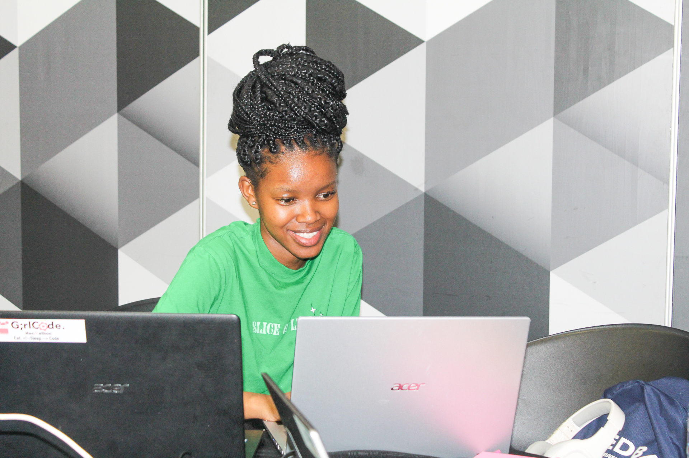
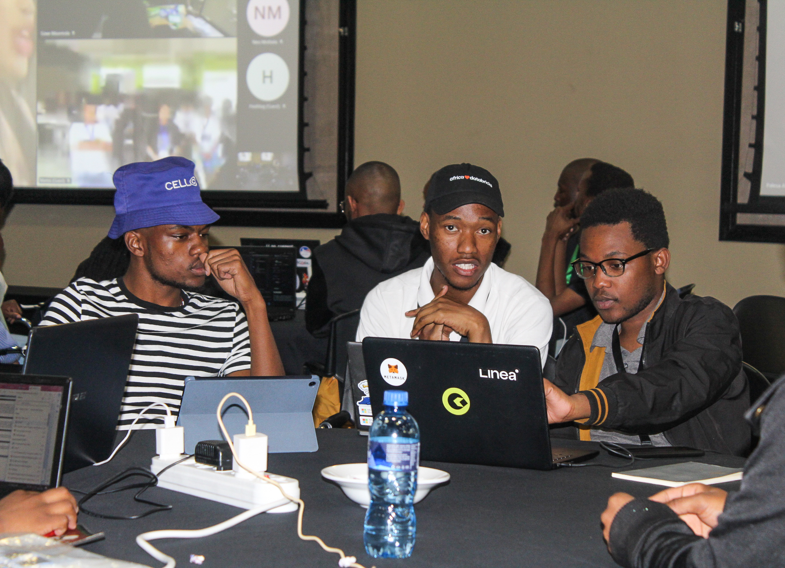

The rise of Artificial Intelligence (AI) is redefining and changing careers, it is for this reason that it is important to introduce South African youth to AI systems to boost their competitiveness in the digital economy. 

On 3-4 November we hosted an AI-themed hackathon that we called the 'AI Mashup', which brought together youth from 4 provinces in South Africa, namely; Gauteng, Limpopo, Kwa-Zulu Natal, and the Northern Cape. In this 'Sustainable AI' themed hackathon, youth were given problem statements to solve using Microsoft  AI services, while contesting to win cash prizes. 

The AI Mashup came to fruition through our partnership with Microsoft and the AI Expo Africa, sponsored by Microsoft, the Youth Employment Service (YES), and the MTN Group. 

### Equipping youth with AI skills 

Youth unemployment and the digital skills gap are some of the concerning factors in SA, according to Stats SA more than 63% of people younger than 24 were unemployed in 2022 and about 42% of those aged 25 to 34 were also unemployed. 

In the third quarter of 2023, the unemployment rate stood at 31.9%, according to Stats SA's report. 

Talking about the AI Mashup and its intention to narrow the digital skills gap and youth unemployment, YES' Chief Information Officer Malcolm  MacDonald said: "The need for AI Skills is paramount in the modern workplace, translating real-world problems into AI solutions is a key skill needed and making this practical through a hackathon was what attracted us to the AI Mashup."

In addition to that, Microsoft believes that economic growth and opportunity must reach every person, organisation, community, and country. 

Microsoft's National Technology Officer Asif Valley said, "This starts with ensuring everyone has the skills to thrive in a digital, AI-enabled economy, and extends to empowering nonprofits, entrepreneurs, and other organisations to digitally transform and address society's biggest challenges".

### Sustaining collaborations for the benefit of South African youth 

As we continue to empower and advance young people, we want to leverage our relationships with Microsoft, the AI Expo Africa, the Youth Employment Service, and the MTN group, for the benefit of young people. 

MTN said that they are actively exploring avenues to expand the scope and scale of these hackathons, ensuring a broader reach and a more profound impact. 

Mohanoe Mokhitli, the General Manager of Data and Analytics at MTN Group's Data & Analytics Centre of Excellence (DACoE),  said, "As we look to the future, we are eager to build on these valuable partnerships and the energy generated by the AI Mashup. We are committed to fostering groundbreaking ideas and transforming them into impactful realities.”

“This event marks the beginning of a journey filled with collaborative efforts that will drive us towards a more connected and prosperous Africa,” He added.

We extend our sincerest gratitude to the Department of Science and Innovation (DSI) for their unwavering support throughout our journey. Our heartfelt thanks also go to the Durban University of Technology, TUT Polokwane, the Galeshewe SMME Village, and Microsoft SA for graciously hosting us. 

A special shoutout and appreciation to our esteemed judges and mentors whose guidance and expertise played a pivotal role in shaping this event.