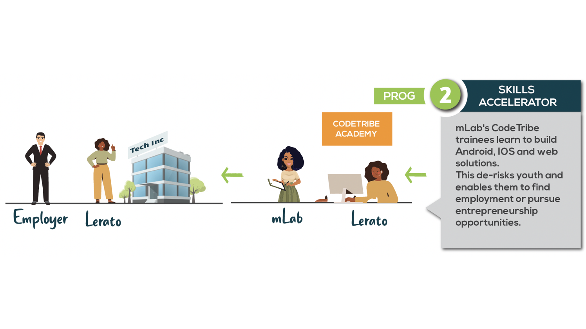
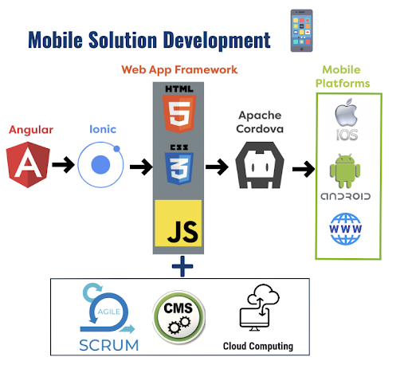

According to the World Bank, more than 230 million jobs will require digital skills in Africa by 2030. Employers are already struggling to find the skills they need to run their businesses. There are many reasons for this but among the reasons is a disjoint between what is traditionally taught and the shifting demand due to emerging technologies. This skills gap is detrimental not only to individual businesses but to economies at large.To bridge the gap, mLab works closely with business partners to ensure its curriculum is closely aligned with business needs. mLab gives young South Africans the skills, experience and confidence to harness the fruit of technology-led prosperity. Our skills development initiatives teach technical expertise, as well as business acumen and the soft skills graduates need to succeed in the working world.

mLab currently runs the CodeTribe Academy in Polokwane, Kimberly, Soweto, Tembisa and Tshwane and aims to drive inclusive digital innovation in South Africa. The programme is accredited by the Institute of Information Technology Professionals South Africa (IITPSA). The coding programme provides training and work experience to talented youth in ICT to develop a portfolio of Android, iOS and Web solutions. Participants are also up-skilled in cloud technologies, scrum agile project management and introduced to 4IR technologies in order to drive their employment and self-employment prospects.

# **SELECTION CRITERIA**

We are looking for passionate and committed young innovators, founders, next generation coders and digital creatives. If you believe you or somebody you know meet the below criteria, we encourage you to apply if calls are open, otherwise register onto our database to be notified when calls open.

**The ideal candidates for this 6 - 12 month programme must have either:**

* Minimum 12 months IT qualification/ NQF level 5 (with programming background)
* Diploma in IT(with programming background)
* Degree/B Tech/Honours in IT (with programming background)
* Qualification in Mathematics/Statistics/Applied Mathematics or IT related field
* Bcom Informatics(Information Systems)

It is specifically noted that candidates with any of the above qualifications will have also completed Matric/Grade 12/ NQF level 4. Candidates with only this level of qualification will only be considered under special circumstances where they can produce sufficient evidence of software development experience in the form of portfolios or qualified references. The mLab believes in encouraging those without this level of qualification to first complete their Matric/Grade 12/NQF Level 4.

**In addition to the above listed requirements, the applicant must:**

* Be a South African citizen with a valid ID.
* Be an unemployed youth/graduate between 18 to 35 years of age.
* Reside within proximity of a CodeTribe Academy facility
* Not have a criminal record.

**Young South African females are encouraged to apply.**

Students in their final year doing their work Integrated learning are also encouraged to apply.

Please note:

Our Skills programme receives a large amount of applications when open. When applications are opened they are promoted on our social media channels, this website and/or partner channels. Due to the high volume the applications are generally only open for a short period of time.

Due to the nature of our businesses we do not accept walk-in meetings at our Labs. To access support please apply to the programmes below. To discuss other matters please contact us to schedule a meeting.

If you have been referred to mLab by any of our partners or others within the ecosystem please apply to our programmes below or contact us.