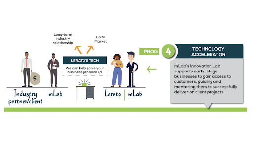

mLab’s Innovation Lab is a creative space where our team supports digital solution development, especially those with a social impact focus.With its feet in both the non-profit and digital enterprise spaces, mLab is uniquely positioned to co-create solutions for some of today’s most challenging scenarios. mLab coding academy graduates and start-ups are included in the projects where possible so that they gain access to customers. mLab de-risks them by providing oversight and mentorship to ensure the successful delivery of client projects. Past projects include a cancer awareness solution, water quality monitoring system for rural communities and an agriculture shared-knowledge repository. Other solutions include a gender-based violence solution for the Ahmed Kathrada Foundation, and youth unemployment solution for the South African Presidency through the Department of Science and Innovation - DSI.