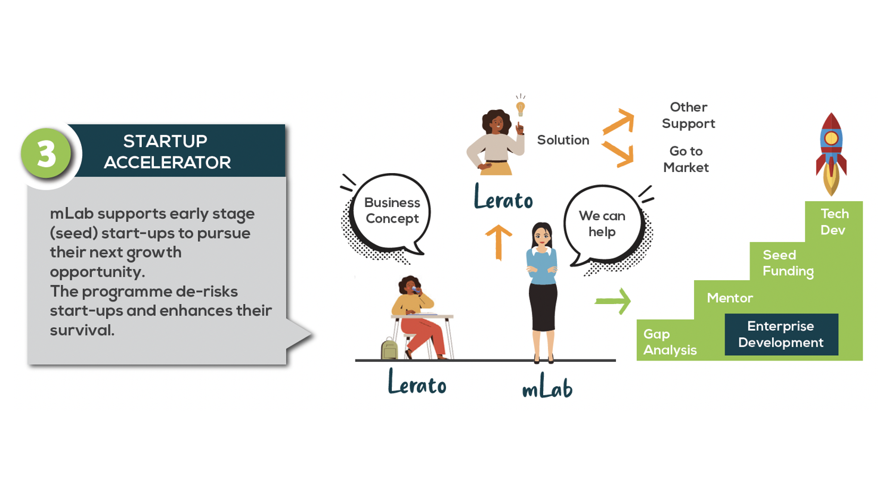
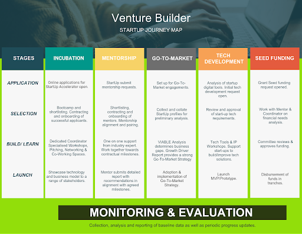

A great business idea is a good start … but where to from there? mLab specialises in supporting early-stage start-ups through our various accelerator programmes. We have developed significant offerings and competencies over the past decade to deliver a value chain of support to entrepreneurs. We have supported hundreds of start-ups in various sectors such as; Transport, Education, Agriculture, e-Commerce, Health and Professional Services amongst others. They in turn have gone on to win awards, gain exposure to international markets, secure growth funding, create hundreds of jobs, generate millions in revenue and positively impact many of our lives.

This Enterprise Development programme supports early-stage founders of tech-enabled businesses to pursue their next growth opportunity. mLab does this through providing critical support services such as gap analysis, go-to-market strategies, mentorship, grant seed funding as well as assistance with digital tools and development of minimal viable products (MVPs). Beneficiaries also benefit from entrepreneurship focused training, networking events, office space, access to equipment and devices amongst other forms of support.

# SELECTION CRITERIA

We are looking for passionate and committed young innovators, founders, next generation coders and digital creatives. If you believe you or somebody you know meet the below criteria, we encourage you to apply if calls are open, otherwise register onto our database to be notified when calls open. 

The below selection criteria serves as a general guideline, specific calls may have slightly different requirements:  

1. Preference will be given to CIPC registered business 
2. Business vintage should be below 5 years
3. Business should be able to demonstrate market validation or market research of business concept and/or business viability
4. Business that are able to demonstrate turnover below R1 million per annum (pre-VAT)
5. Preference will be given to business between B-BBEE level 1 and level 4
6. Preference will be given to businesses with female directorship or shareholding
7. Preference will be given to businesses with youth directorship or shareholding
8. Businesses are recommended to have more than one team member in order to ensure business continuity and dynamism

##### Please Note:

Selection for mLab’s enterprise development programme is a very competitive process and applicants are advised to summit their best submission with clear and accurate information. Once submitted the application will be reviewed as is and no requests for in person presentations or sharing further information by phone will be facilitated. Due to the high volume of applicants per season - mLab and its partners will only communicate with candidates selected to move into the next evaluation stage. Should you not receive feedback within 2 months of the application closing date your application may be deemed unsuccessful and you are invited to apply again the following season with an improved proposal. Applicants who receive a notice of referral to mLab from other parties should note  that their application with that partner has most likely been unsuccessful and that the referral to mLab entails undergoing mLab’s independent review process. Kindly note that referrals do not represent a progression of any 3rd party’s application process and does not circumvent any mLab recruitment and selection processes. 

<!--EndFragment-->